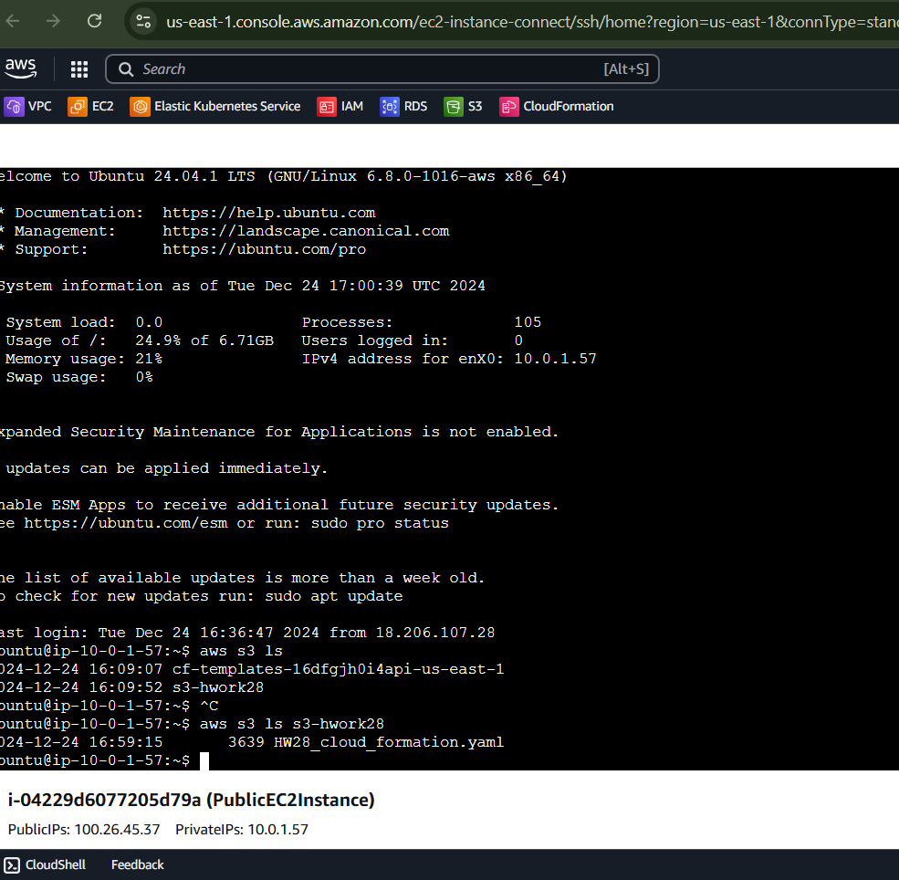

## AWS CloudFormation

### [<log-AWS_Cloudformation.md>](./log-AWS_Cloudformation.md)

#### Використовуючи CloudFormation, створюємо інфраструктуру, яка включає:
#### VPC, EC2 інстанс, IAM Role для доступу до S3 bucket, S3 Bucket

### Створюємо S3 сервіс в aws


### Створюємо stack  AWS_Cloudformation_Homework_28


### Template для stack  AWS_Cloudformation формуємо в вигляді файла HW28_cloud_formation.yaml
###  **VPC**
- **VPC з CIDR-блоком 10.0.0.0/16.**
  ```yaml
  myVPC:
    Type: AWS::EC2::VPC
    Properties:
      CidrBlock: 10.0.0.0/16
      EnableDnsSupport: true
      EnableDnsHostnames: true
  ```

- **Додали публічну підмережу (10.0.1.0/24) та приватну підмережу (10.0.4.0/24).**
  ```yaml
  publicSubnet:
    Type: AWS::EC2::Subnet
    Properties:
      CidrBlock: 10.0.1.0/24
      VpcId: !Ref myVPC
      MapPublicIpOnLaunch: true
  privateSubnet:
    Type: AWS::EC2::Subnet
    Properties:
      CidrBlock: 10.0.4.0/24
      VpcId: !Ref myVPC
  ```

- **Internet Gateway та прив’язали його до VPC.**
  ```yaml
  myIGW:
    Type: AWS::EC2::InternetGateway
  attachIGW:
    Type: AWS::EC2::VPCGatewayAttachment
    Properties:
      VpcId: !Ref myVPC
      InternetGatewayId: !Ref myIGW
  ```

- **Налаштували Route Table для виходу в інтернет.**
  ```yaml
  publicRT:
    Type: AWS::EC2::RouteTable
    Properties:
      VpcId: !Ref myVPC
  publicRoute:
    Type: AWS::EC2::Route
    DependsOn: attachIGW
    Properties:
      RouteTableId: !Ref publicRT
      DestinationCidrBlock: 0.0.0.0/0
      GatewayId: !Ref myIGW
  publicSubnetRTAssoc:
    Type: AWS::EC2::SubnetRouteTableAssociation
    Properties:
      SubnetId: !Ref publicSubnet
      RouteTableId: !Ref publicRT
  ```

---

###  **EC2 Інстанс**
- **EC2 у публічній підмережі з Amazon Linux 2 та IAM роллю.**
  ```yaml
  publicEC2:
    Type: AWS::EC2::Instance
    Properties:
      InstanceType: t2.micro
      SubnetId: !Ref publicSubnet
      SecurityGroupIds:
        - !Ref mySG
      ImageId: ami-0c02fb55956c7d316  # Amazon Linux 2
      IamInstanceProfile: !Ref InstanceProfile
  ```

---

###  **IAM Роль**
- **Створити IAM роль з політикою `AmazonS3ReadOnlyAccess` та призначити її EC2.**
  ```yaml
  S3ReadOnlyRole:
    Type: AWS::IAM::Role
    Properties:
      AssumeRolePolicyDocument:
        Version: "2012-10-17"
        Statement:
          - Effect: Allow
            Principal:
              Service: ec2.amazonaws.com
            Action: sts:AssumeRole
      ManagedPolicyArns:
        - arn:aws:iam::aws:policy/AmazonS3ReadOnlyAccess
  InstanceProfile:
    Type: AWS::IAM::InstanceProfile
    Properties:
      Roles:
        - !Ref S3ReadOnlyRole
  ```

---

###  **S3 Bucket**
- **Створити S3 bucket із унікальним ім’ям `S3-HWork28`, увімкнути версіонування та налаштувати політику.**
  ```yaml
  MyS3Bucket:
    Type: AWS::S3::Bucket
    Properties:
      BucketName: S3-HWork28
      VersioningConfiguration:
        Status: Enabled
  BucketPolicy:
    Type: AWS::S3::BucketPolicy
    Properties:
      Bucket: !Ref MyS3Bucket
      PolicyDocument:
        Version: "2012-10-17"
        Statement:
          - Effect: Deny
            Principal: "*"
            Action: "s3:*"
            Resource:
              - !Sub "arn:aws:s3:::${MyS3Bucket}/*"
            Condition:
              Bool:
                aws:SecureTransport: false
  ```

### Після аплоаду через бакет файлу для темплейта запускаємо стек


### Timeline  створення Cloudformation stack 

---

###  **Outputs**
- **Вивести Public IP EC2 та назву S3 bucket.**
  ```yaml
  Outputs:
    publicInstanceIP:
      Description: Public IP of EC2 Instance
      Value: !GetAtt publicEC2.PublicIp
    S3BucketName:
      Description: Name of the created S3 Bucket
      Value: !Ref MyS3Bucket
  ```


###  Під*єднуємося до створеного ЕС2 інстансу >>>>


Щоб під'єднати створений S3 bucket (`S3-HWork28`) до EC2 інстансу у файлі CloudFormation,
використовується IAM роль з політикою `AmazonS3ReadOnlyAccess`. Ця роль вже прив’язана до EC2 через
Instance Profile. Таким чином, EC2 інстанс отримає доступ до S3 за допомогою цієї ролі.



**IAM роль (`S3ReadOnlyRole`)**:
    - Має політику `AmazonS3ReadOnlyAccess`, яка дозволяє читання з S3.
    - Прив’язана до EC2 через Instance Profile (`InstanceProfile`).

**Прив’язка Instance Profile до EC2**:
    - Параметр `IamInstanceProfile` у ресурсі `publicEC2`:
```yaml
      IamInstanceProfile: !Ref InstanceProfile
```

### EC2 вже має повноваження через IAM роль.

### S3 bucket


**Увімкнуто версіонування.**


 


### Оновлення ресурсів вручну і перевірка на DRIFT:


**Оновлення ресурсів вручну:**
   AWS Management Console або CLI, щоб внести зміни до ресурсів.
###    - Наприклад, видаляємо сабнету private network
   
   


### Перевірка дрейфу (Drift Detection):**
##### Після внесення змін вручну виконуємо перевірку на дрейф, щоб визначити,
##### чи збігаються поточні ресурси з тим, що описано в CloudFormation шаблоні.
**Через консоль AWS:**
**AWS Management Console**.
**CloudFormation**.AWS_Cloudformation_Homework_28
**Actions > Detect Drift**.

**результати у вкладці Drift Status**
   


**Через CLI:**

**Використовуємо команду:**
   ```bash
   aws cloudformation detect-stack-drift --stack-name AWS_Cloudformation_Homework_28
   ```

  
   

   Перевіряємо статус дрейфу:
   ```bash
   aws cloudformation describe-stack-resource-drifts --stack-name AWS_Cloudformation_Homework_28
   ```

**дрейф виявлено,**

  - **Оновлюємо template:**

**(у yaml  файлі додаємо іншу мережу для   privateSubnet:)**

**CidrBlock: 10.0.5.0/24 замість  CidrBlock: 10.0.4.0/24**
 
**Оновлюємо стек після внесення змін:**
   зміни вимагають оновлення CloudFormation:
   ```bash
   aws cloudformation update-stack --stack-name STACK-HW28-cloud-formation --template-body file://HW28_cloud_formation.yaml --capabilities CAPABILITY_NAMED_IAM

   ```
**Підтягнулася нова підмережа privateSubnet:) CidrBlock: 10.0.5.0/24**


**Перевірка дрейфу дозволяє гарантувати, що конфігурація**

**ресурсів залишається узгодженою зі створеним шаблоном.**


