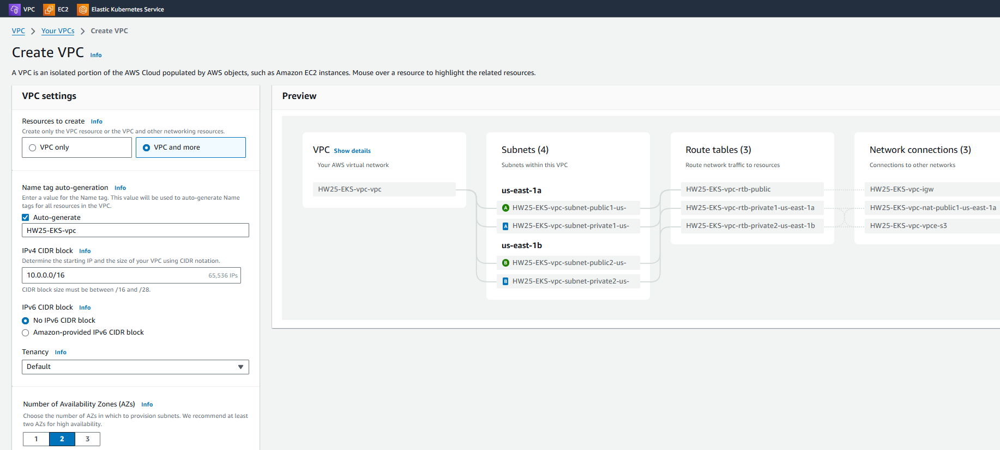
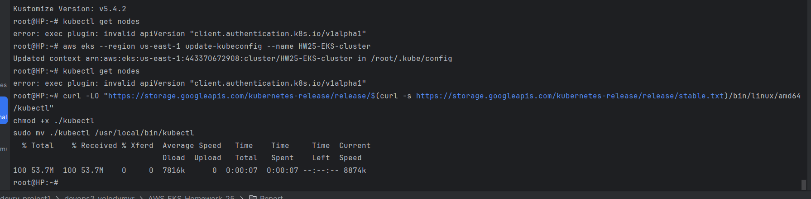
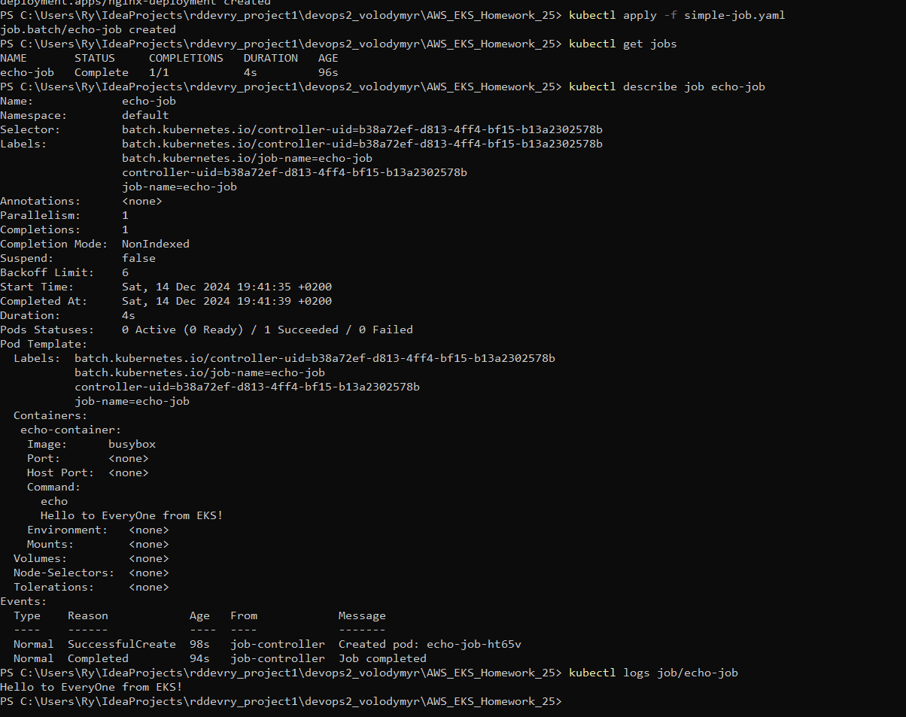
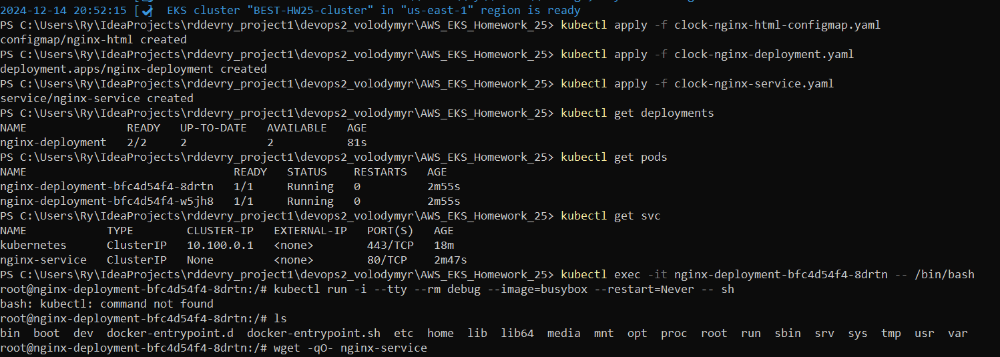

### [<Посилання на лог>](./log_aws_EKS-HWork25.md)
### Використовуючи AWS Management Console , створюємо кластер EKS
 Попередньо створюємо vpc з приватними та публічними сабнетами у 2х зонах



### конфігуруємо доступ до кластера з AWS CLI





-----------------------------


### Потім усе створене AWS Management Console видаляємо і працюємо з `eksctl` 


### Початковий конфіг кластеру


### Щоб розгорнути статичний вебсайт за допомогою Kubernetes на кластері  необхідно  кілька кроків, включаючи створення ConfigMap, Deployment та Service типу LoadBalancer.

### Кроки для реалізації


**Створення ConfigMap для вебсайту**

   Для того, щоб передати файл `index.html` (або інші статичні файли) до контейнера Nginx, створимо ConfigMap, який буде містити вміст цих файлів.

    файл `web-content-configmap.yaml`:

   ```yaml
   apiVersion: v1
   kind: ConfigMap
   metadata:
     name: web-content
   data:
     index.html: |
       <html>
       <head><title>HELLO WORLD</title></head>
       <body>
         <h1>HELLO WORLD</h1>
       </body>
       </html>
   ```

   Цей ConfigMap містить HTML файл, який буде відображатися на вебсайті.

**Створення Deployment для розгортання Nginx**

   Створимо файл `nginx-deployment.yaml` для розгортання Nginx з використанням ConfigMap для передачі файлу `index.html`.

   ```yaml
   apiVersion: apps/v1
   kind: Deployment
   metadata:
     name: nginx-deployment
   spec:
     replicas: 1
     selector:
       matchLabels:
         app: nginx
     template:
       metadata:
         labels:
           app: nginx
       spec:
         containers:
           - name: nginx
             image: nginx:latest
             volumeMounts:
               - name: web-content
                 mountPath: /usr/share/nginx/html
         volumes:
           - name: web-content
             configMap:
               name: web-content
   ```

   У цьому файлі:
    - Використовуємо образ `nginx:latest`.
    - Монтуємо `ConfigMap` до папки `/usr/share/nginx/html`, що є стандартним місцем для статичних файлів Nginx.

**Створення Service типу LoadBalancer**

   Тепер необхідно створити Service для забезпечення доступу до нашого вебсайту з публічного Інтернету. Створимо файл `nginx-service.yaml`:

   ```yaml
   apiVersion: v1
   kind: Service
   metadata:
     name: nginx-service
   spec:
     selector:
       app: nginx
     ports:
       - protocol: TCP
         port: 80
         targetPort: 80
     type: LoadBalancer
   ```

   У цьому файлі:
    - Вказуємо тип сервісу `LoadBalancer`, що дозволяє отримати публічну IP-адресу для доступу до вебсайту.

**Застосування ресурсів до кластеру**

   Тепер, коли ми створили всі необхідні YAML файли, застосуємо їх до кластеру EKS за допомогою kubectl:

   ```bash
   kubectl apply -f web-content-configmap.yaml
   kubectl apply -f nginx-deployment.yaml
   kubectl apply -f nginx-service.yaml
   ```


   Це створить ConfigMap, Deployment і Service у кластері EKS.

**Перевірка публічного IP і доступності вебсайту**

  AWS створить публічний IP для  LoadBalancer. 

   ```bash
   kubectl get svc nginx-service
   ```


   Це надає додаткову інформацію про стан сервісу і підтверджує, що доступний він з публічної мережі.


###  Створення PersistentVolumeClaim (PVC) для збереження даних

Для збереження даних на AWS EBS диску в Kubernetes, потрібно створити PersistentVolumeClaim (PVC) із динамічним створенням сховища (StorageClass). розглянемо поетапно:

####  Створення StorageClass для динамічного створення PersistentVolume

AWS використовує `gp2`  як тип EBS дисків для зберігання даних. Kubernetes має стандартний `ebs-sc` StorageClass, що дозволяє автоматично створювати EBS-томи.

Створюємо файл `ebs-storageclass.yaml`:

```yaml
apiVersion: storage.k8s.io/v1
kind: StorageClass
metadata:
  name: ebs-sc
provisioner: kubernetes.io/aws-ebs
parameters:
  type: gp2  # Використовуємо стандартний тип диска AWS EBS gp2
```

Цей файл створює StorageClass, який використовує AWS EBS.

####  Створення PersistentVolumeClaim (PVC)

Тепер створимо PersistentVolumeClaim для використання з EBS.

Створюємо файл `persistent-volume-claim.yaml`:

```yaml
apiVersion: v1
kind: PersistentVolumeClaim
metadata:
  name: ebs-pvc
spec:
  accessModes:
    - ReadWriteOnce
  resources:
    requests:
      storage: 5Gi
  storageClassName: ebs-sc
```

Цей PVC створює вимогу до 5Gi дискового простору з використанням StorageClass `ebs-sc`.

Створення Pod для використання PVC

Після того, як PersistentVolumeClaim створений, можна створити Pod, який буде використовувати цей PVC для збереження даних.

Створюємо файл `pod-with-pvc.yaml`:

```yaml
apiVersion: v1
kind: Pod
metadata:
  name: pod-with-ebs
spec:
  containers:
    - name: nginx
      image: nginx
      volumeMounts:
        - mountPath: /usr/share/nginx/html
          name: ebs-volume
  volumes:
    - name: ebs-volume
      persistentVolumeClaim:
        claimName: ebs-pvc
```

Цей Pod використовує PVC `ebs-pvc` для монтування EBS диска в каталог `/usr/share/nginx/html`. Це дозволяє зберігати файли, які будуть зберігатися на EBS-диску.

####  Застосування ресурсів

Тепер застосуємо всі ресурси до кластеру:

```bash
kubectl apply -f ebs-storageclass.yaml
kubectl apply -f persistent-volume-claim.yaml
kubectl apply -f pod-with-pvc.yaml
```

#### Перевірка статусу

Після застосування цих ресурсів можна перевірити, чи було створено PersistentVolume, та чи використовує Pod цей PVC:

```bash
kubectl get pvc
kubectl get pv
kubectl get pods
```


###  Створення Job для запуску простого завдання


Створимо Job, який виконує просту команду `echo "Hello to everyOne from EKS!"`.

 файл `simple-job.yaml`:

```yaml
apiVersion: batch/v1
kind: Job
metadata:
  name: echo-job
spec:
  template:
    spec:
      containers:
        - name: echo-container
          image: busybox
          command: ["echo", "Hello to everyOne from EKS!"]
      restartPolicy: Never
```

Цей Job використовує контейнер `busybox` і виконує команду `echo`.

#### 2. Застосування Job до кластеру

```bash
kubectl apply -f simple-job.yaml
```


На підготовчому етапі було більш приземлено "Hello from EKS"


#### Перевірка виконання Job

Щоб перевірити статус Job і чи було завдання виконано успішно
```bash
kubectl get jobs
kubectl describe job echo-job
kubectl logs job/echo-job
```




---


### Створюємо і розгортаємо простий тестовий застосунок у середовищі 
### AWS EKS

### Створення тестового застосунку файл `nginx-html-configmap.yaml`
Для цього створимо просту HTML сторінку за допомогою сервера Nginx.

**Створення конфігураційного файлу для Deployment**:
   файл `nginx-deployment.yaml`, який описує розгортання застосунку:

   ```yaml
   apiVersion: apps/v1
   kind: Deployment
   metadata:
     name: nginx-deployment
   spec:
     replicas: 2
     selector:
       matchLabels:
         app: nginx
     template:
       metadata:
         labels:
           app: nginx
       spec:
         containers:
         - name: nginx
           image: nginx:latest
           ports:
           - containerPort: 80
           volumeMounts:
             - mountPath: /usr/share/nginx/html
               name: html-volume
         volumes:
           - name: html-volume
             configMap:
               name: nginx-html
   ```

   У цьому файлі:
   - Використовуємо образ `nginx:latest`.
   - Створюємо 2 репліки.
   - Вказуємо порт 80 для доступу до веб-сервера.

   **Створення ConfigMap для HTML сторінки**:
       HTML сторінка, наприклад `index.html`, яка відображає поточний час. Для цього створимо ConfigMap:

   файл `nginx-html-configmap.yaml`:

      ```yaml
      apiVersion: v1
      kind: ConfigMap
      metadata:
        name: nginx-html
      data:
        index.html: |
          <!DOCTYPE html>
          <html lang="en">
          <head>
              <meta charset="UTF-8">
              <meta name="viewport" content="width=device-width, initial-scale=1.0">
              <title>Test App</title>
          </head>
          <body>
              <h1>Current Time: <span id="time"></span></h1>
              <script>
                  function updateTime() {
                      const timeElement = document.getElementById('time');
                      const now = new Date();
                      timeElement.textContent = now.toLocaleTimeString();
                  }
                  setInterval(updateTime, 1000);
                  updateTime();
              </script>
          </body>
          </html>
      ```

**Створення Service для доступу до застосунку всередині кластера**:
    файл `nginx-service.yaml` для налаштування внутрішнього доступу до застосунку через тип Service `ClusterIP`:

   ```yaml
   apiVersion: v1
   kind: Service
   metadata:
     name: nginx-service
   spec:
     selector:
       app: nginx
     ports:
       - protocol: TCP
         port: 80
         targetPort: 80
     clusterIP: None  # Це забезпечить доступ лише всередині кластера
   ```


------------------------------------------


### Розгортання застосунку в EKS
**Створення ConfigMap**:
   команда для створення ConfigMap з файлом HTML:
   ```bash
   kubectl apply -f clock-nginx-html-configmap.yaml
   ```

**Розгортання Deployment**:
   команда для створення Deployment:
   ```bash
   kubectl apply -f clock-nginx-deployment.yaml
   ```

**Створення Service**:
    команда для створення Service:
   ```bash
   kubectl apply -f clock-nginx-service.yaml
   ```




### Перевірка доступу до застосунку
** статус Deployment**:
    репліки були створені правильно:
   ```bash
   kubectl get deployments
   ```
** статус подів**:
    поди працюють:
   ```bash
   kubectl get pods
   ```
**Перевірте Service**:
   Service створений правильно:
   ```bash
   kubectl get svc
   ```

**Тестування доступу всередині кластера**:
   Щоб перевірити доступ до застосунку всередині кластера, 
підключаємося до поду та звертаємося до сервісу через DNS ім’я:

   

Або прокидуємо порти для доступу ззовні


###### При цьому в браузері локальної машини спостерігаємо вікно з аплікацією RealTime Clock
   
   


###  Створення неймспейсу `dev`
Щоб створити окремий неймспейс (namespace) та розгорнути застосунок у цьому неймспейсі в Kubernetes
Спершу створюємо новий неймспейс, у якому буде розгорнуто застосунок.
файл `namespace-dev.yaml`,  описує неймспейс:

```yaml
apiVersion: v1
kind: Namespace
metadata:
  name: dev
```

```bash
kubectl apply -f namespace-dev.yaml
```

###  Створення Deployment в неймспейсі `dev`
 Deployment, який буде запускати 5 реплік контейнерів на основі образу `busybox`, де кожен контейнер виконуватиме команду `sleep 3600`.

файл `busybox-deployment-dev.yaml` для опису Deployment:

```yaml
apiVersion: apps/v1
kind: Deployment
metadata:
  name: busybox-deployment
  namespace: dev
spec:
  replicas: 5
  selector:
    matchLabels:
      app: busybox
  template:
    metadata:
      labels:
        app: busybox
    spec:
      containers:
        - name: busybox
          image: busybox:latest
          command: ["sleep", "3600"]
```

Тут:
- `namespace: dev` вказує, що Deployment має бути розгорнутий в неймспейсі `dev`.
- `replicas: 5` вказує, що потрібно створити 5 реплік контейнерів.
- Контейнер використовує образ `busybox:latest` і виконує команду `sleep 3600`,  (1 година).

- Deployment:
```bash
kubectl apply -f busybox-deployment-dev.yaml
```

##### Перевірка статусу Deployment

```bash
kubectl get deployments -n dev
```


##### Перевірка подів
 статус подів у неймспейсі `dev`,  всі контейнери запущені:

```bash
kubectl get pods -n dev
```


#### Згортаємо кластер


