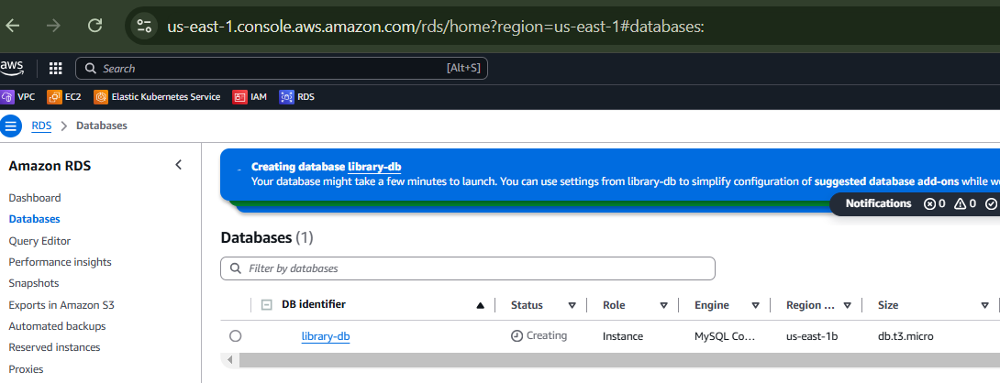
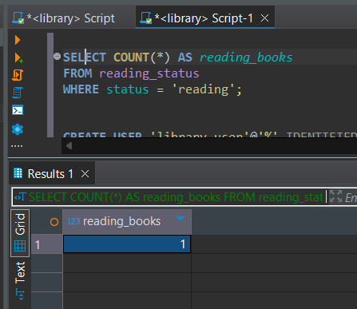
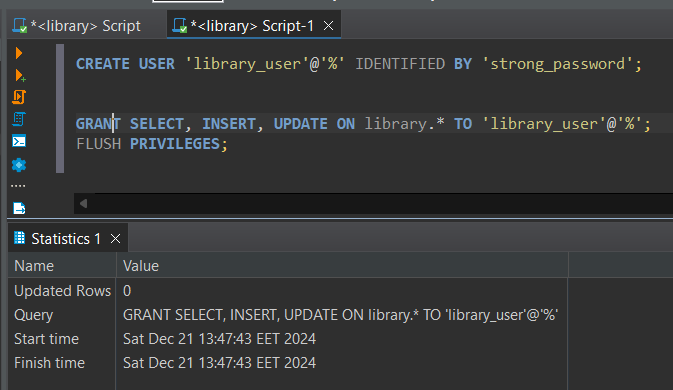

### [<Посилання на лог>](./log_aws_RDS-HWork27.md)

## AWS DB Services на прикладі RDS інстансу
### Створюємо vpc і subnet group для RDS-інстансу


### Створюємо Instance, враховуючи що vpc і subnet уже створені
* Вибираємо Create database
  
* 
* Тип бази: MySQL 
* Шаблон: Free tier
* Конфігурація:
  * DB instance identifier: library-db
  * Master username: admin
  * Master password: надійний пароль credential management
  * DB instance class: db.t3.micro
  * Дисковий простір: 20 ГБ (General Purpose SSD)
  * Public access для підключення до бази з комп'ютера
* У розділі Network & Security:
    * Вибираємо існуючу VPC RSS-HW27
    *  нова security group, з модифікованими правилами доступу до IP DB-RDX
      
###  створення інстансу.



## Підключення до бази

   1. Під'єднуємося до бази даних за допомогою DBEAVER
   2.  параметри підключення, надані в RDS (адреса хоста, порт 3306, ім'я користувача admin та пароль)
      
      

## Створення бази даних та таблиць

### Створення бази даних library:

```sql
CREATE DATABASE library;
USE library;
```

### Створення трьох таблиць для зберігання даних про авторів, книги та статус читання:

Таблиця №1

```sql
CREATE TABLE authors (
    id INT AUTO_INCREMENT PRIMARY KEY,
    name VARCHAR(255) NOT NULL,
    country VARCHAR(255)
);
```

Таблиця №2

```sql
CREATE TABLE books (
    id INT AUTO_INCREMENT PRIMARY KEY,
    title VARCHAR(255) NOT NULL,
    author_id INT,
    genre VARCHAR(50),
    FOREIGN KEY (author_id) REFERENCES authors(id)
);
```

Таблиця №3
```sql
CREATE TABLE reading_status (
    id INT AUTO_INCREMENT PRIMARY KEY,
    book_id INT,
    status ENUM('reading', 'completed', 'planned') NOT NULL,
    last_updated TIMESTAMP DEFAULT CURRENT_TIMESTAMP,
    FOREIGN KEY (book_id) REFERENCES books(id)
);
```

##  Внесення даних

Додаємо кількох авторів:

```sql
INSERT INTO authors (name, country) VALUES 
('George Orwell', 'United Kingdom'),
('J.K. Rowling', 'United Kingdom'),
('Haruki Murakami', 'Japan');
```

Додаємо кілька книг:

```sql
INSERT INTO books (title, author_id, genre) VALUES 
('1984', 1, 'Dystopian'),
('Harry Potter and the Philosopher\'s Stone', 2, 'Fantasy'),
('Kafka on the Shore', 3, 'Magical realism');
```

Додаємо статус для однієї з книг:

```sql
INSERT INTO reading_status (book_id, status) VALUES 
(1, 'reading');
```


### Виконання запитів

Знаходимо всі книги, які ще не прочитані:

```sql
SELECT books.title, authors.name 
FROM books
JOIN authors ON books.author_id = authors.id
LEFT JOIN reading_status ON books.id = reading_status.book_id
WHERE reading_status.status IS NULL OR reading_status.status != 'completed';
```


Визначте кількість книг, які в процесі читання:

```sql
SELECT COUNT(*) AS reading_books
FROM reading_status
WHERE status = 'reading';
```


### Налаштування доступу

Створюємо нового користувача для бази даних:

```sql
CREATE USER 'library_user'@'%' IDENTIFIED BY 'strong_password';
```


Надаємо йому права:

```sql
GRANT SELECT, INSERT, UPDATE ON library.* TO 'library_user'@'%';
FLUSH PRIVILEGES;
```



## Моніторинг та резервне копіювання

#### Вмикаємо автоматичне резервне копіювання у налаштуваннях RDS (Backup retention period: 7 днів).


#####  Для того щоб **увімкнути автоматичне резервне копіювання** на RDS інстансі та встановити **период збереження резервних копій на 7 днів**, вам необхідно використовувати команду `modify-db-instance`.

####

```bash
aws rds modify-db-instance \
    --db-instance-identifier library-db \
    --backup-retention-period 7 \
    --apply-immediately
```

 

   


**Перегляд метрики CPU utilization**:

```bash
aws cloudwatch get-metric-statistics \
    --namespace AWS/RDS \
    --metric-name CPUUtilization \
    --dimensions Name=DBInstanceIdentifier,Value=library-db \
    --start-time 2024-12-20T00:00:00Z \
    --end-time 2024-12-21T00:00:00Z \
    --period 3600 \
    --statistics Average
```


- `--namespace AWS/RDS`: Вказуємо, що ми працюємо з метриками для сервісу RDS.
- `--metric-name CPUUtilization`: Опис метрики, в даному випадку **CPUUtilization**.
- `--dimensions`: Описує вимірювання для вашого інстансу, де вказується ідентифікатор інстансу (в даному випадку `library-db`).
- `--start-time` та `--end-time`: Часовий інтервал для збору метрики.
- `--period 3600`: Інтервал агрегації метрики в секундах (1 година в даному випадку).
- `--statistics Average`: Тип статистики, яку ми хочемо отримати (в даному випадку середнє значення за кожен період).

**Перегляд метрики Connections**:

```bash
aws cloudwatch get-metric-statistics \
    --namespace AWS/RDS \
    --metric-name DatabaseConnections \
    --dimensions Name=DBInstanceIdentifier,Value=library-db \
    --start-time 2024-12-20T00:00:00Z \
    --end-time 2024-12-21T00:00:00Z \
    --period 36000 \
    --statistics Sum

```


#### Перегляд метрики IOPS (операції вводу/виводу за секунду):


```

aws cloudwatch get-metric-statistics \
--namespace AWS/RDS \
--metric-name ReadIOPS \
--dimensions Name=DBInstanceIdentifier,Value=library-db \
--start-time 2024-12-21T00:00:00Z \
--end-time 2024-12-21T10:00:00Z \
--period 36000 \
--statistics Average
```


#### метрики AWS-RDS інстансу  в CloudWatch (CPU utilization, connections, IOPS).


