### [<log-Terraform_no-modules>](./AWS_Terraform_no_modules/log-Terraform_no-modules.md)

### [<log-AWS_Terraform>](./log-AWS_Terraform.md)

# AWS Terraform

В роботі створено 2 варіанта Terraform структури, які розгортають в середовищі AWS 
VPC, підмережі, EC2-інстанси:
#### варіант без використання модульної структури у папці [AWS_Terraform_no_modules](./AWS_Terraform_no_modules)
#### варіант з використанням модулів у папці [T_Form_modules](./T_Form_modules)

Для створення модульної структури в Terraform, розділяємо конфігурацію на кілька модулів: для VPC, підмереж, EC2 інстансів та інших компонентів, що використовуються у  інфраструктурі. Ось  структура проекту.

### Структура каталогів:
```
.
├── main.tf
├── variables.tf
├── outputs.tf
├── terraform.tfvars
├── modules
│   ├── vpc
│   │   ├── main.tf
│   │   └── variables.tf
│   ├── subnet
│   │   ├── main.tf
│   │   └── variables.tf
│   ├── ec2
│   │   ├── main.tf
│   │   └── variables.tf
└── init.sh
```

### 1. **Модуль для VPC (`modules/vpc/main.tf`):**

```hcl
resource "aws_vpc" "my_vpc" {
  cidr_block = var.vpc_cidr

  tags = {
    Name = "MyVPC"
  }
}

resource "aws_internet_gateway" "igw" {
  vpc_id = aws_vpc.my_vpc.id
}

resource "aws_route_table" "rt" {
  vpc_id = aws_vpc.my_vpc.id

  tags = {
    Name = "PublicRouteTable"
  }
}

resource "aws_route" "public_rt" {
  route_table_id         = aws_route_table.rt.id
  destination_cidr_block = "0.0.0.0/0"
  gateway_id             = aws_internet_gateway.igw.id
}

output "vpc_id" {
  value = aws_vpc.my_vpc.id
}

output "igw_id" {
  value = aws_internet_gateway.igw.id
}

output "route_table_id" {
  value = aws_route_table.rt.id
}
```

#### `modules/vpc/variables.tf`:
```hcl
variable "vpc_cidr" {
  description = "CIDR block for VPC"
  type        = string
}
```

### 2. **Модуль для підмережі (`modules/subnet/main.tf`):**

```hcl
resource "aws_subnet" "public_subnet" {
  vpc_id                  = var.vpc_id
  cidr_block              = var.public_subnet_cidr
  map_public_ip_on_launch = true
  availability_zone       = var.availability_zone

  tags = {
    Name = "PublicSubnet"
  }
}

resource "aws_subnet" "private_subnet" {
  vpc_id            = var.vpc_id
  cidr_block        = var.private_subnet_cidr
  availability_zone = var.availability_zone

  tags = {
    Name = "PrivateSubnet"
  }
}

output "public_subnet_id" {
  value = aws_subnet.public_subnet.id
}

output "private_subnet_id" {
  value = aws_subnet.private_subnet.id
}
```

#### `modules/subnet/variables.tf`:
```hcl
variable "vpc_id" {
  description = "ID of the VPC"
  type        = string
}

variable "public_subnet_cidr" {
  description = "CIDR for public subnet"
  type        = string
}

variable "private_subnet_cidr" {
  description = "CIDR for private subnet"
  type        = string
}

variable "availability_zone" {
  description = "Availability Zone"
  type        = string
}
```

### 3. **Модуль для EC2-інстансів (`modules/ec2/main.tf`):**

```hcl
resource "aws_instance" "public_instance" {
  ami             = var.ami_id
  instance_type   = var.instance_type
  subnet_id       = var.public_subnet_id
  security_groups = var.security_groups
  key_name        = var.key_name
  user_data       = var.user_data

  tags = {
    Name = "PublicInstance"
  }
}

resource "aws_instance" "private_instance" {
  ami             = var.ami_id
  instance_type   = var.instance_type
  subnet_id       = var.private_subnet_id
  security_groups = var.security_groups
  key_name        = var.key_name

  tags = {
    Name = "PrivateInstance"
  }
}

output "public_instance_ip" {
  value = aws_instance.public_instance.public_ip
}

output "private_instance_ip" {
  value = aws_instance.private_instance.private_ip
}
```

#### `modules/ec2/variables.tf`:
```hcl
variable "ami_id" {
  description = "AMI for EC2"
  type        = string
}

variable "instance_type" {
  description = "EC2 instance type"
  type        = string
}

variable "public_subnet_id" {
  description = "Public subnet ID"
  type        = string
}

variable "private_subnet_id" {
  description = "Private subnet ID"
  type        = string
}

variable "security_groups" {
  description = "Security groups"
  type        = list(string)
}

variable "key_name" {
  description = "SSH key pair name"
  type        = string
}

variable "user_data" {
  description = "User data script"
  type        = string
}
```

### 4. **Основний конфігураційний файл (`main.tf`)**:

```hcl
provider "aws" {
  region = "us-east-1"
}

module "vpc" {
  source   = "./modules/vpc"
  vpc_cidr = var.vpc_cidr
}

module "subnet" {
  source               = "./modules/subnet"
  vpc_id               = module.vpc.vpc_id
  public_subnet_cidr   = var.public_subnet_cidr
  private_subnet_cidr  = var.private_subnet_cidr
  availability_zone    = data.aws_availability_zones.available.names[0]
}

module "ec2" {
  source              = "./modules/ec2"
  ami_id              = var.ami_id
  instance_type       = var.instance_type
  public_subnet_id    = module.subnet.public_subnet_id
  private_subnet_id   = module.subnet.private_subnet_id
  security_groups     = [aws_security_group.my_sg.id]
  key_name            = var.key_name
  user_data           = file("init.sh")
}

data "aws_availability_zones" "available" {}

resource "aws_security_group" "my_sg" {
  vpc_id      = module.vpc.vpc_id
  description = "Allow SSH, HTTP, HTTPS"

  ingress {
    description = "SSH"
    from_port   = 22
    to_port     = 22
    protocol    = "tcp"
    cidr_blocks = ["0.0.0.0/0"]
  }

  ingress {
    description = "HTTPS"
    from_port   = 443
    to_port     = 443
    protocol    = "tcp"
    cidr_blocks = ["0.0.0.0/0"]
  }

  egress {
    from_port   = 0
    to_port     = 0
    protocol    = "-1"
    cidr_blocks = ["0.0.0.0/0"]
  }

  tags = {
    Name = "MySecurityGroup"
  }
}
```

### 5. **Файл `variables.tf` (для основного конфігураційного файлу):**

```hcl
variable "vpc_cidr" {
  description = "CIDR block for VPC"
  default     = "10.0.0.0/16"
}

variable "public_subnet_cidr" {
  description = "CIDR for public subnet"
  default     = "10.0.10.0/24"
}

variable "private_subnet_cidr" {
  description = "CIDR for private subnet"
  default     = "10.0.20.0/24"
}

variable "ami_id" {
  description = "AMI for EC2"
}

variable "key_name" {
  description = "SSH Key Pair name"
}

variable "instance_type" {
  description = "EC2 instance type"
  default     = "t3.micro"
}
```

### 6. **Файл `terraform.tfvars`**:
```hcl
vpc_cidr           = "10.0.0.0/16"
public_subnet_cidr = "10.0.10.0/24"
private_subnet_cidr = "10.0.20.0/24"
ami_id             = "ami-0866a3c8686eaeeba"
key_name           = "H_Work22"
instance_type      = "t3.micro"
```

### 7. **Файл `init.sh`**:
Цей файл може бути скриптом для ініціалізації інстанса, наприклад, для налаштування веб-сервера або інсталяції програмного забезпечення.

```bash
#!/bin/bash
# Example user data script
apt-get update -y
apt-get install -y apache2
service apache2 start
```

### 

1. **Модулі**:
    - `vpc`: створює VPC, інтернет-шлюз та маршрутні таблиці.
    - `subnet`: створює публічні та приватні підмережі.
    - `ec2`: створює EC2 інстанси в публічній та приватній підмережах.

2. **Основний конфігураційний файл**: в ньому ви викликаємо ці модулі та передаємо відповідні параметри.

3. **Terraform Variables**: параметри для  інфраструктури, такі як CIDR блоки, AMI, типи інстансів, ключі SSH тощо.

### Завантаження:

 - команда `terraform init` для ініціалізації Terraform.
 - команда `terraform plan`, щоб перевірити конфігурацію.
 - команда `terraform apply` для застосування інфраструктури.

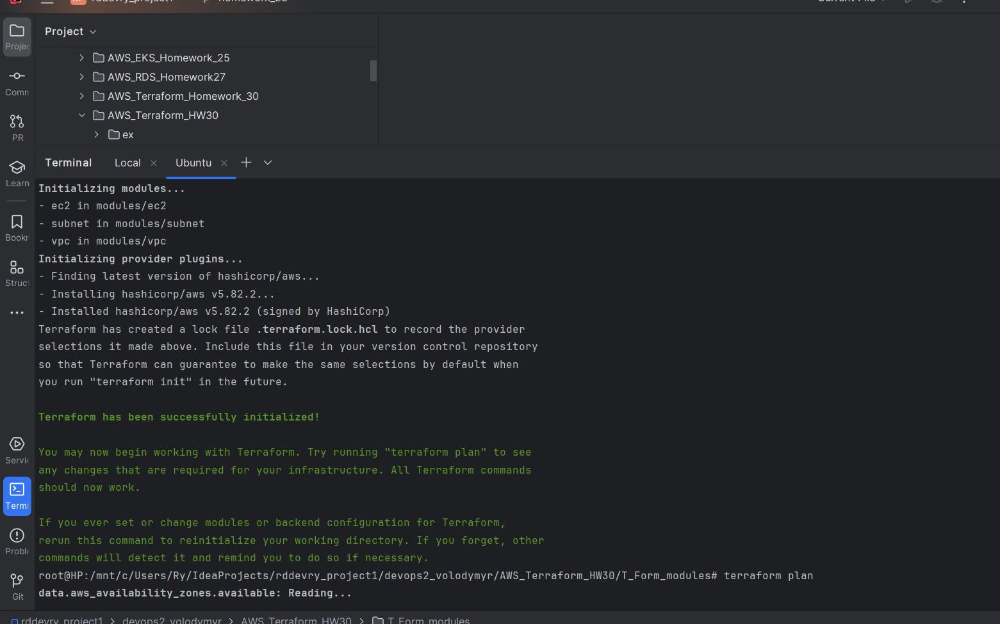
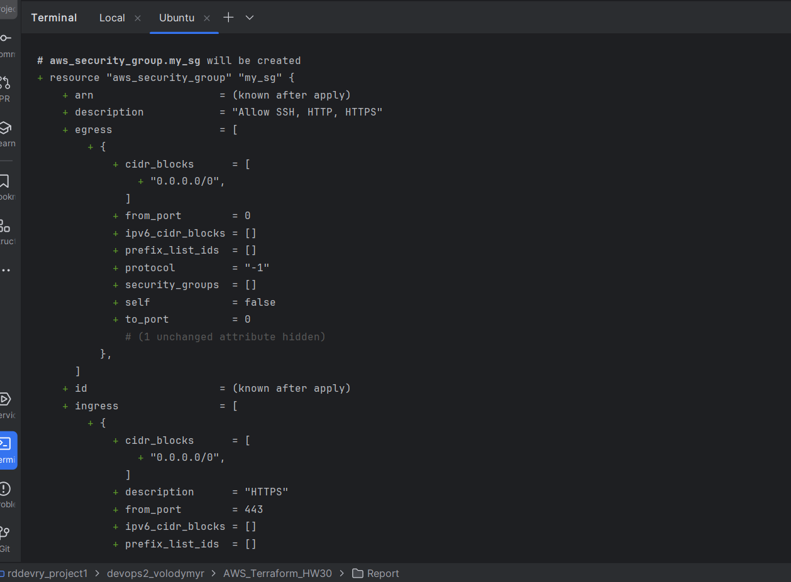
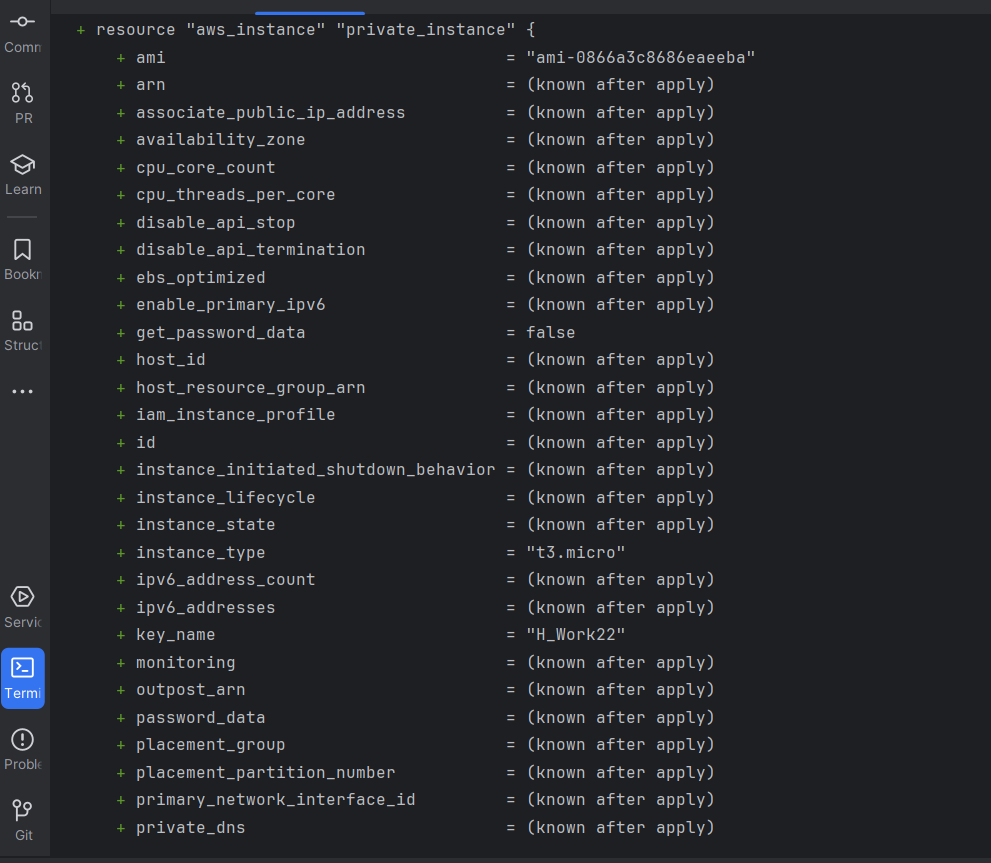
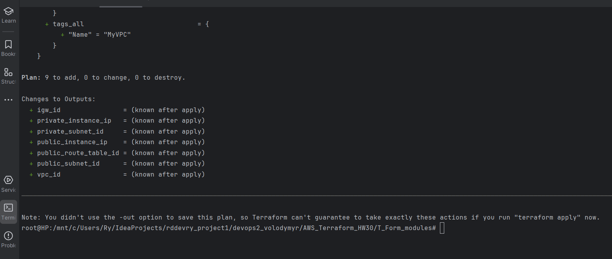
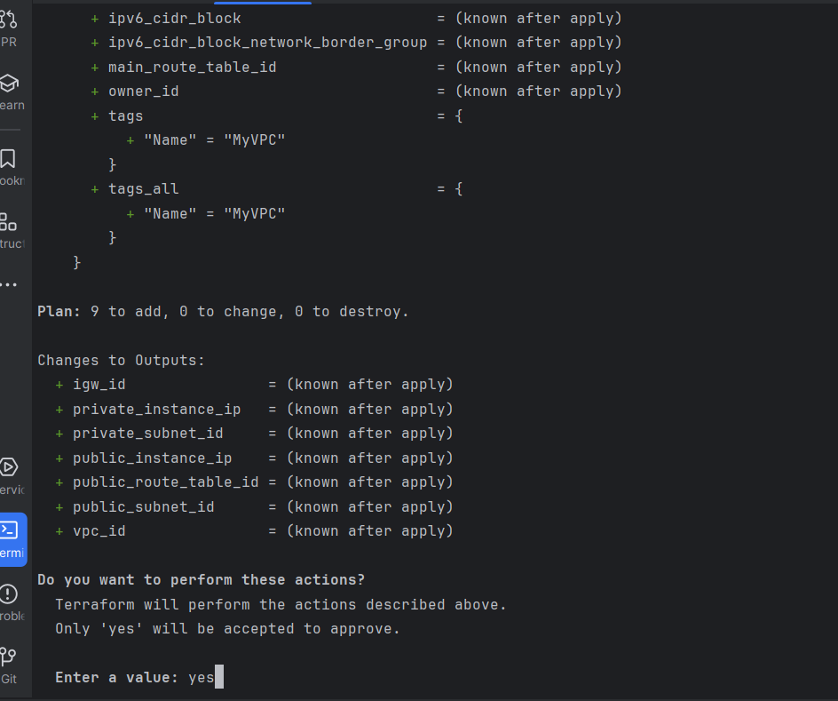
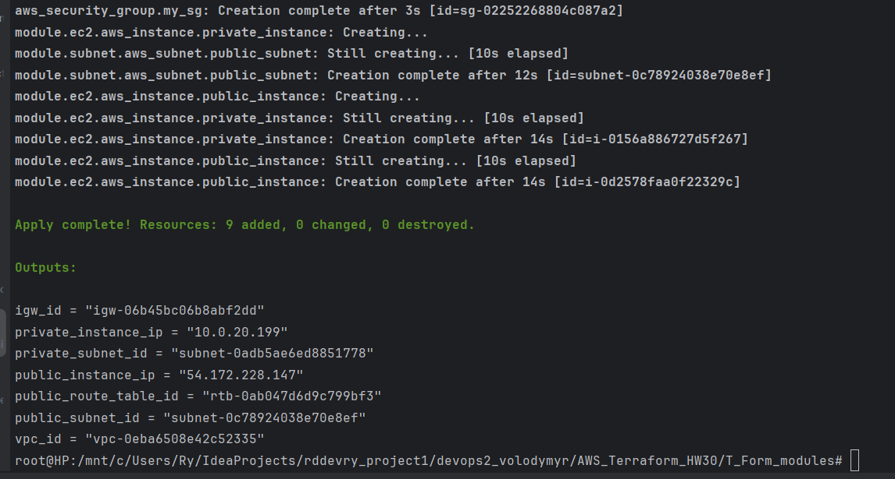
---
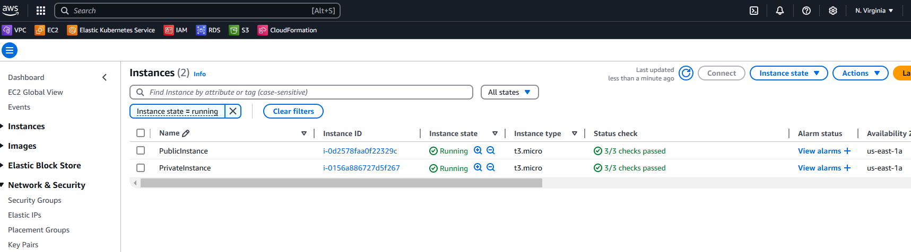
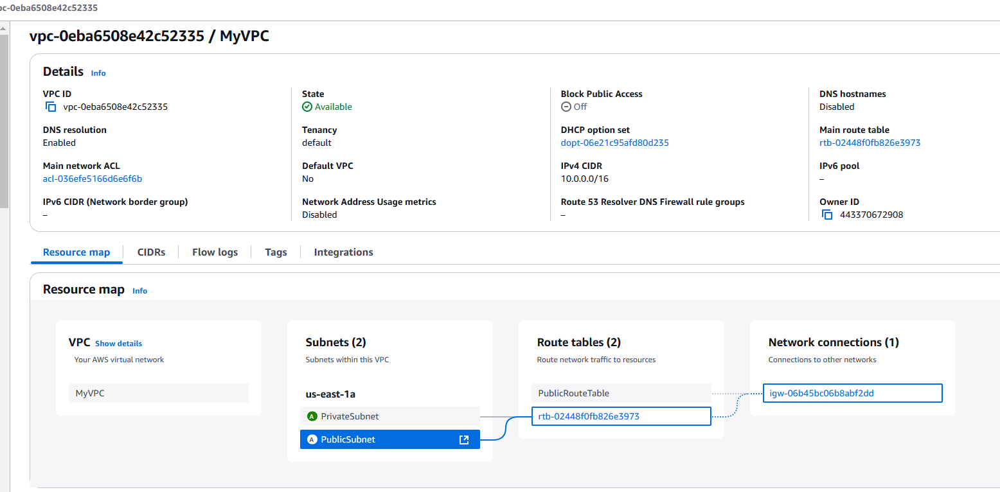
### Заходимо на створений `ec2-inctance`
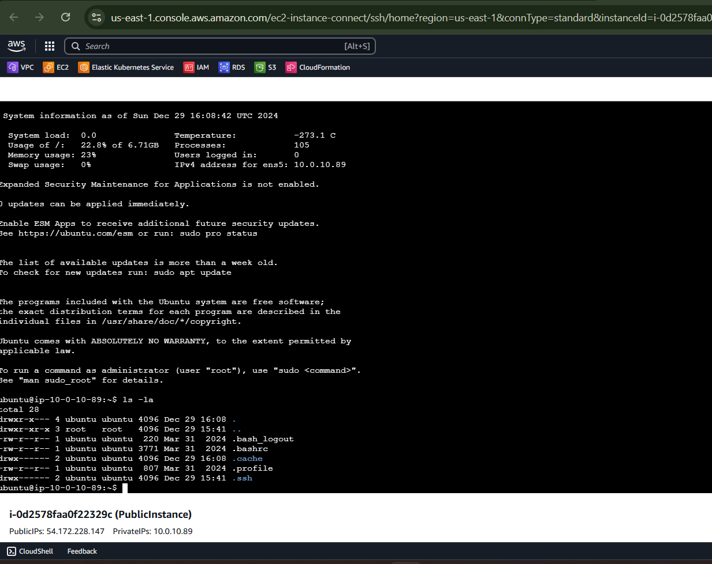


### **Створюємо ресурс (s3) вручну через AWS Management Console**

#### Ім'я для  S3 bucket  bucket = "my-terraform-s3o00o".
#### Регіон  region = "us-east-1"


### **В `main.tf` додаємо наш bucket**

```hcl
resource "aws_s3_bucket" "example" {
  bucket = "my-terraform-s3o00o"
}
```

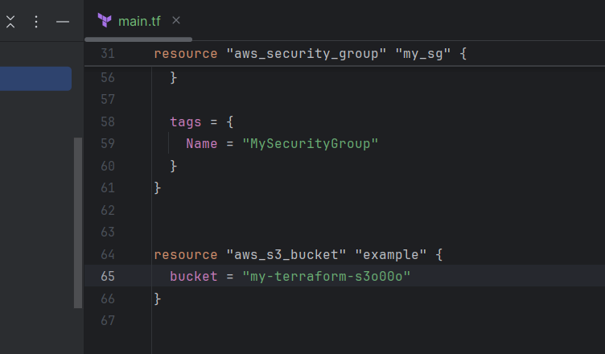


### **Імпортуємо ресурс за допомогою команди `terraform import`**


```bash
terraform import aws_s3_bucket.example my-terraform-s3o00o
```

- `aws_s3_bucket.example` — це ідентифікатор ресурсу, як він визначений у конфігурації Terraform.
- ` "my-terraform-s3o00o"` — це ім'я вже існуючого S3 bucket, який створили вручну через консоль AWS.

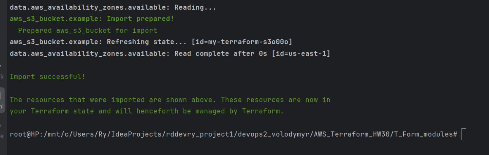
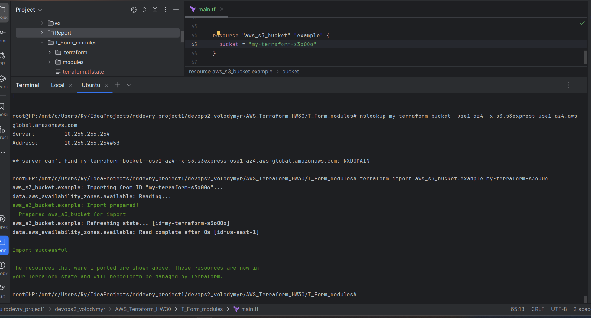

### **Перевірка, що Terraform імпортував ресурс**

Після виконання команди імпорту переконуємося що ресурс був доданий до стейту Terraform:

```bash
terraform state list
```

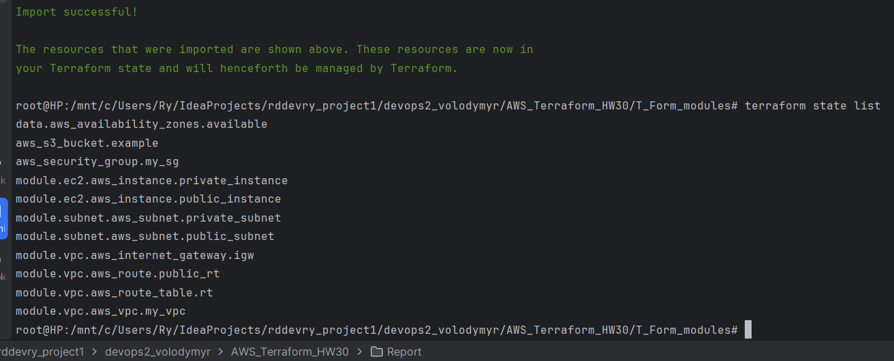

ресурс, який було імпортовано в `terraform.tfstate`:

```
aws_s3_bucket.example
```

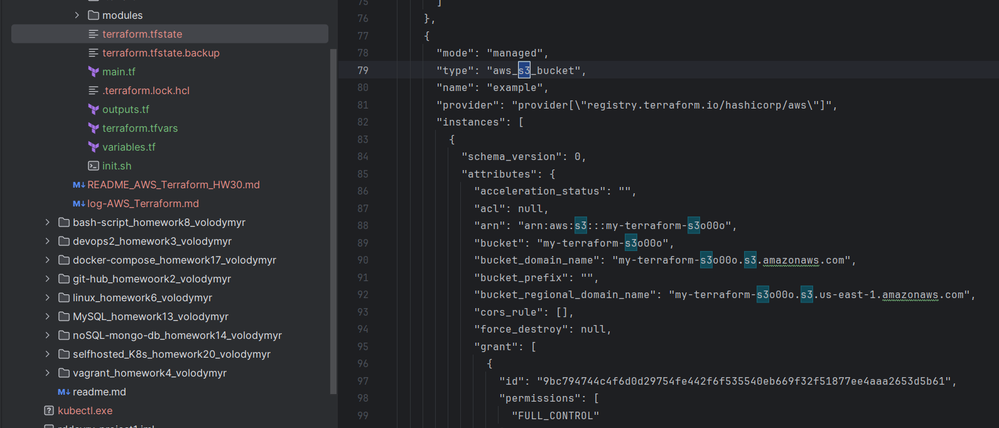

### **Перевірка конфігурації за допомогою `terraform plan`**


Якщо конфігурація Terraform відповідає існуючому стану ресурсу (який ви імпортували), Terraform не запропонує змін. Якщо ви додасте або зміните конфігурацію, Terraform надасть вам план змін.

### **Переконуємося, що Terraform не створює новий ресурс**

Якщо конфігурація і стан збігаються, Terraform не створюватиме новий ресурс. Бачимо повідомлення, що ресурси вже існують і відповідають конфігурації.


 Для подальшого використання ресурсу можна додати додаткові параметри до конфігурації. (налаштувати політику доступу або версіювання для S3 bucket, змінюємо конфігурацію в `main.tf`:

```hcl
resource "aws_s3_bucket" "example" {
  bucket = "my-terraform-s3o00o"  
  acl    = "private"  # Політика доступу

  versioning {
    enabled = true  # Включити версіювання
  }

  tags = {
    Name        = "MyBucket"
    Environment = "Production"
  }
}
```


```bash
terraform plan
```


```bash
terraform apply
```

 