## AWS Basic:
### Створення та налаштування VPC, підмереж, інтернет-шлюзу, EC2 інстансу та EIP в AWS

### [< view log_aws_ec2-HWork22>](./log_aws_ec2-HWork22.md)

#### 1. Створення та налаштування VPC

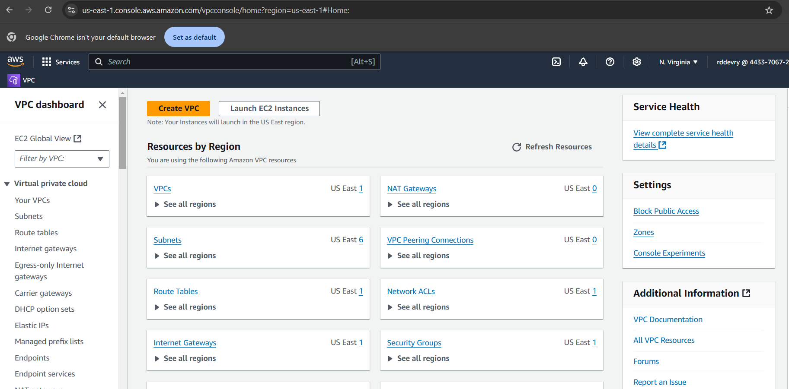

* Створення VPC  
Заходимо в консоль AWS.
Переходимо в сервіс **VPC**.
Вибираємо **Create VPC**.
CIDR блок для VPC ( 10.0.0.0/16). Це буде основна мережа, яка містить всі наші підмережі.


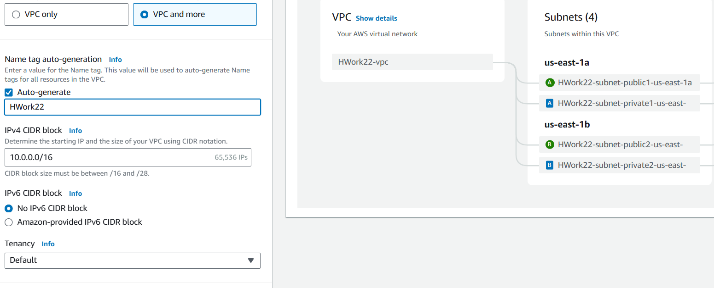

* Number of public subnets2 and
* Number private subnets 2
* Один NAT Gateway та S3 Gateway  у зоні

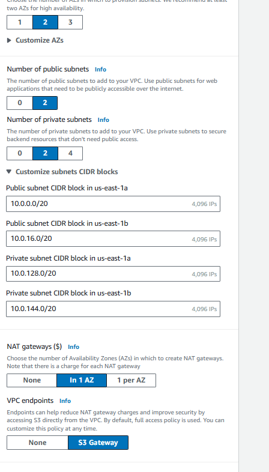
* Залишаємо інші параметри за замовчуванням, якщо не потрібно налаштовувати додаткові параметри.
Натискаємо **Create**.

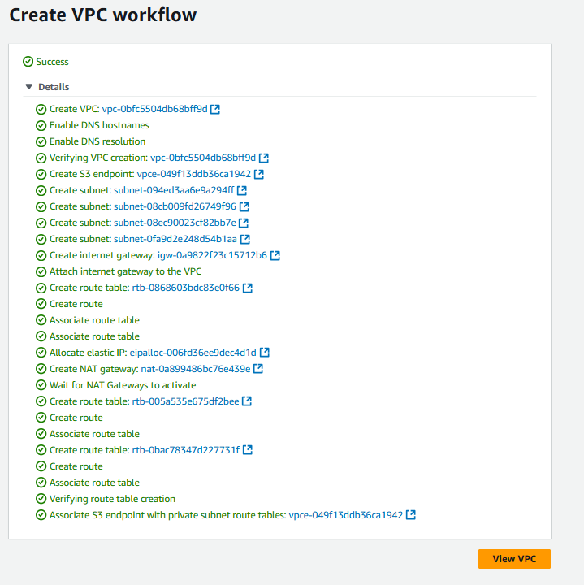
* Створення підмереж в даному випадку пройшло автоматично

* Для створення публічної підмережі:
    - Вибираємо VPC, створену раніше.
    - Вводимо ім'я підмережі (наприклад, `Public Subnet`).
    - Вказуємо CIDR блок для публічної підмережі
    - ( 10.0.0.0/20)- для us-east-1a Availability Zone та
    - ( 10.16.0.0/20). для us-east-1b Availability Zone .
     
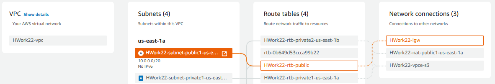

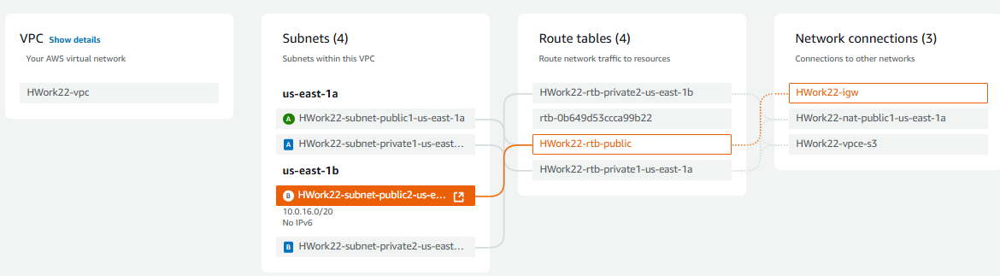

* Створення підмереж приватних в даному випадку пройшло автоматично
* Для створення приватної підмережі:
    - Повторюємо ті ж кроки, вказуючи ім'я підмережі (наприклад, `Private Subnet`).
      Вказуємо CIDR блок для приветних підмереж 
    - ( 10.0.128.0/20)    - для us-east-1a Availability Zone та
    - ( 10.0.144.0/20)    - для us-east-1b Availability Zone .
  
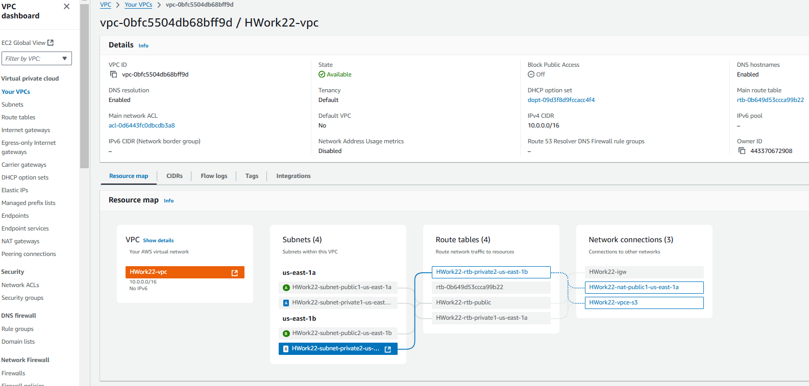

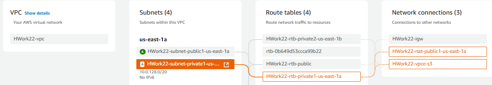
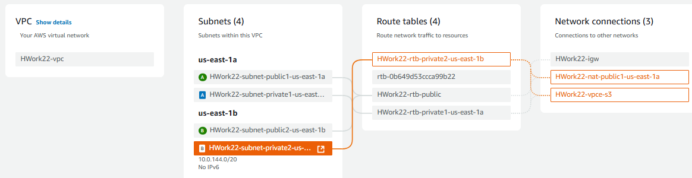

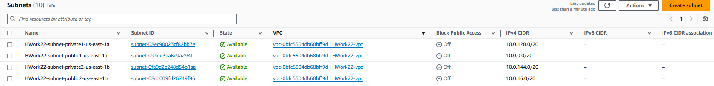

* Створення та налаштування інтернет-шлюзу (Internet Gateway)
пройшло також автоматично**
  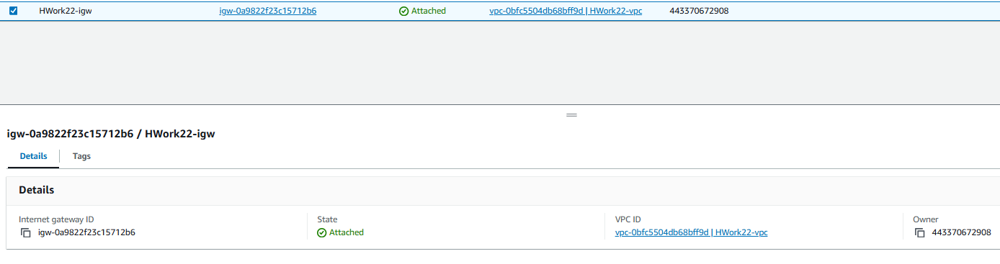
  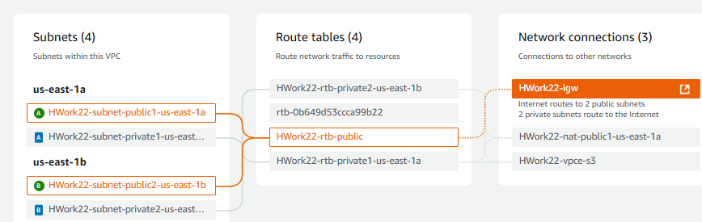

якщо вручну:
* **Internet Gateways** і натискаємо **Create internet gateway**.
 `InternetGateway` Після створення, прив'язуємо інтернет-шлюз до VPC, вибираючи **Attach to VPC**.


###  NAT Gateway
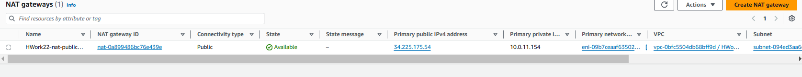

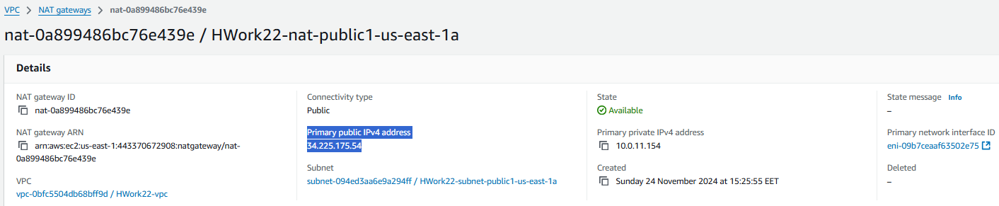
* 
* Налаштування таблиць маршрутизації**
В даному випадку також пройшло автоматично
 Якщо вручну  переходимо до **Route Tables**. Створюємо нову таблицю маршрутизації для публічної підмережі, вибираючи **Create route table**.
Додаємо новий маршрут, який направляє весь трафік (0.0.0.0/0) до інтернет-шлюзу.
Прив'язуємо таблицю маршрутизації до публічної підмережі через **Subnet Associations**.
Для приватної підмережі використовуємо іншу таблицю маршрутизації без маршруту до інтернет-шлюзу (якщо не потрібен доступ до Інтернету).
  
####  Налаштування груп безпеки (Security Groups) та списків контролю доступу (ACL) 

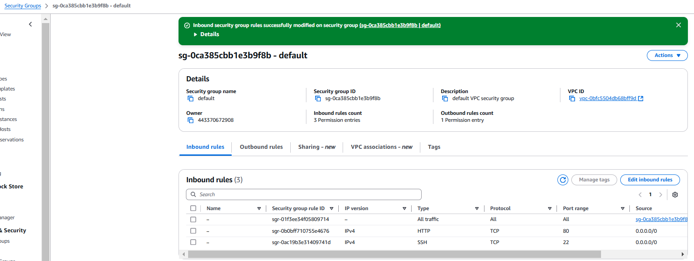
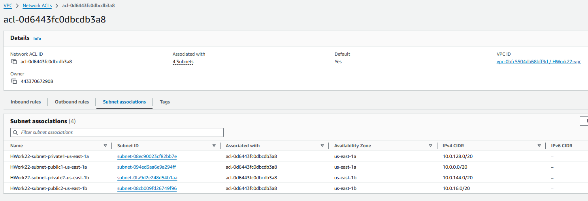

**Security Group**
 **EC2** > **Security Groups**.
Створюємо нову групу безпеки `SecurityGroup`).
Додаємо правила для дозволу вхідного HTTP та SSH трафіку з будь-якої IP-адреси:
    - Додаємо правило для порту **22 (SSH)** з джерела **0.0.0.0/0**.
    - Додаємо правило для порту **80 (HTTP)** з джерела **0.0.0.0/0**.

**Network ACLs**
**Network ACLs** і вибираємо VPC. Створено новий ACL і додано вхідні та вихідні правила для дозволу HTTP та SSH трафіку (як в Security Group)
але окремо по входу і окремо по виходу.
Прив'язуємо ACL до підмережі.

### Запуск інстансу EC2

* Створення інстансу EC2**
Перейдімо в **EC2** > **Instances** і натискаємо **Launch Instance**.
  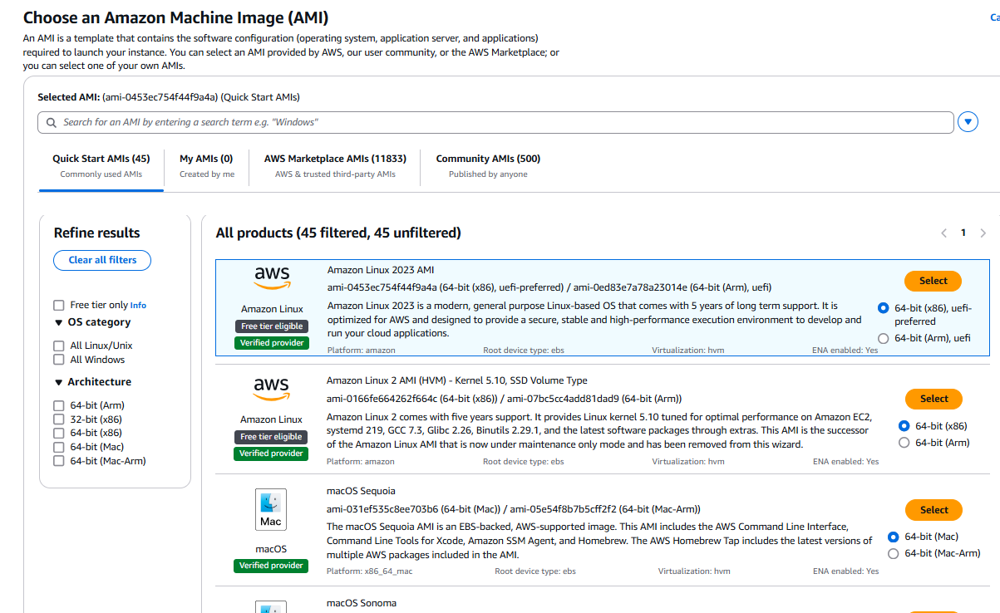

* Вибираємо **Amazon Linux  AMI**. Вибираємо тип інстансу (наприклад, **t2.micro**, який є безкоштовним).
Вибираємо публічну підмережу для інстансу. Вибираємо вже створену групу безпеки.
 
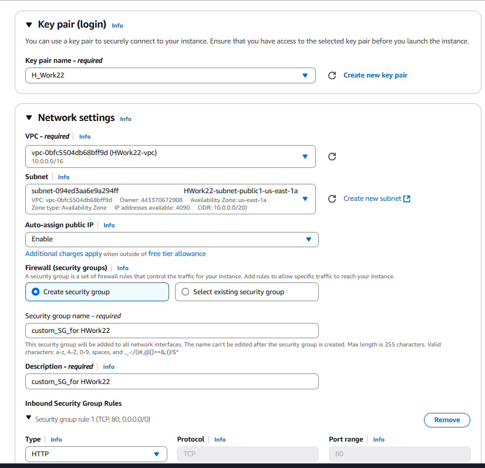

* Додаємо пару ключів для SSH доступу:
    -  створюємо нову і завантажуємо приватний ключ.

  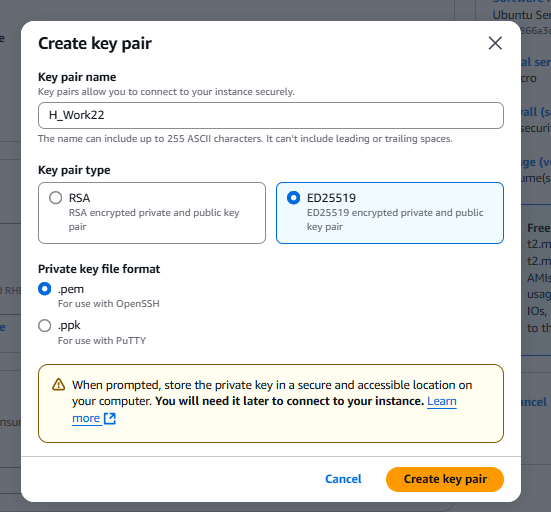

 ### Запускаємо інстанс.
  
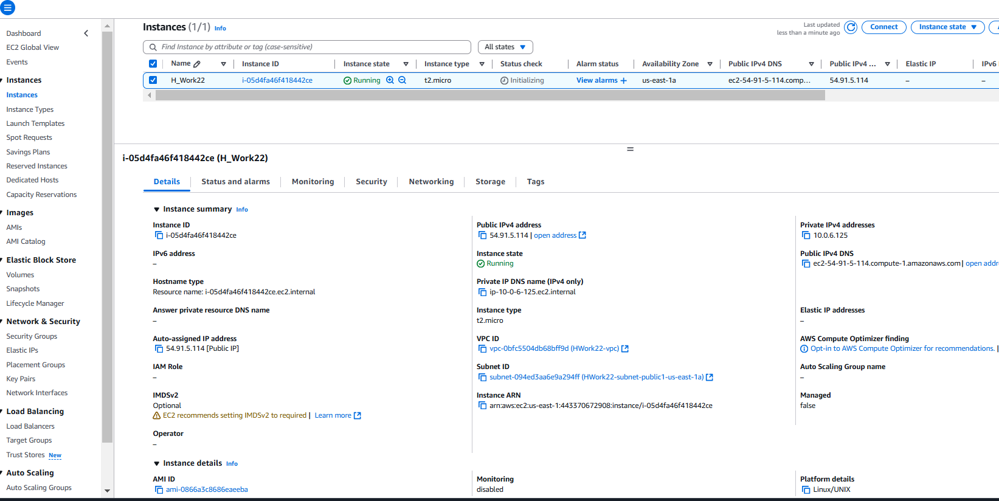
  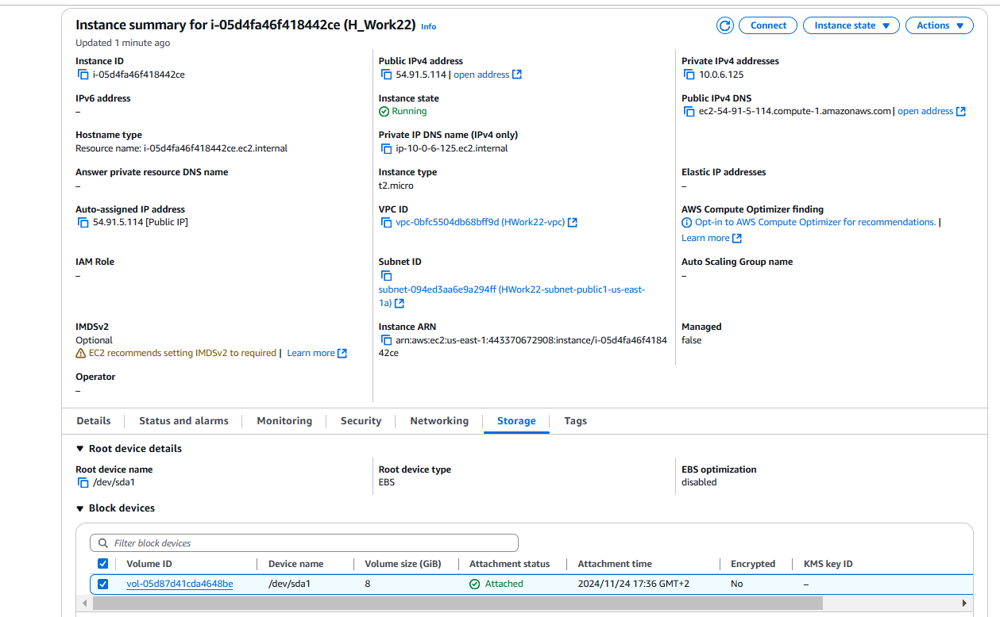
  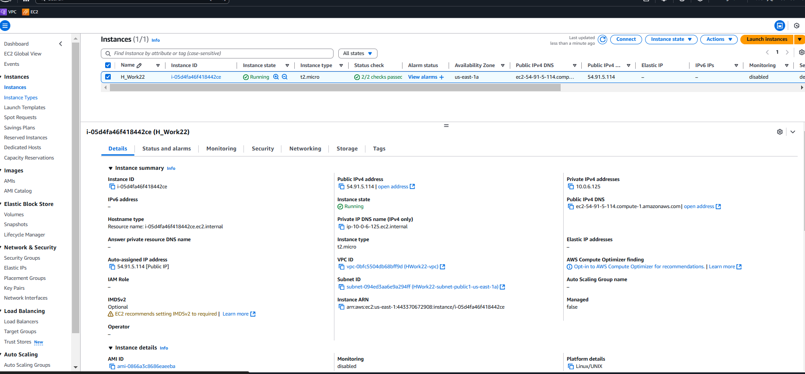


#### Призначення еластичної IP-адреси (EIP)

* Створення та призначення EIP** (створено)
**Elastic IPs** в консолі AWS. Натискаємо **Allocate new address** для створення нової еластичної IP-адреси.
Після створення, вибираємо **Actions** і натискаємо **Associate address**. Вибираємо інстанс EC2, до якого потрібно призначити EIP, і натискаємо **Associate**.
Тепер інстанс EC2 має доступ до Інтернету через публічну IP-адресу та можна підключатися до нього через SSH, використовуючи EIP.
  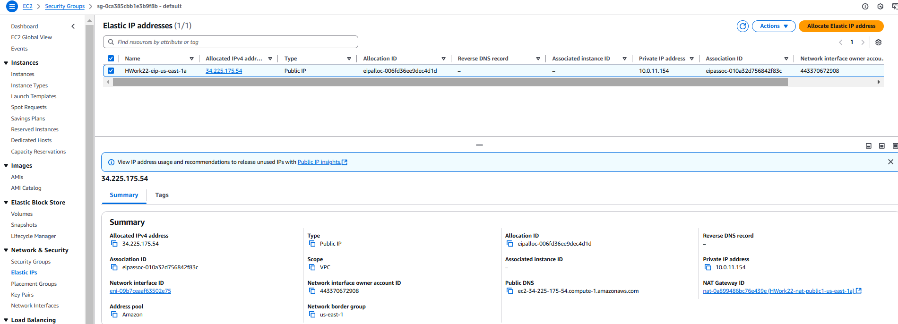
  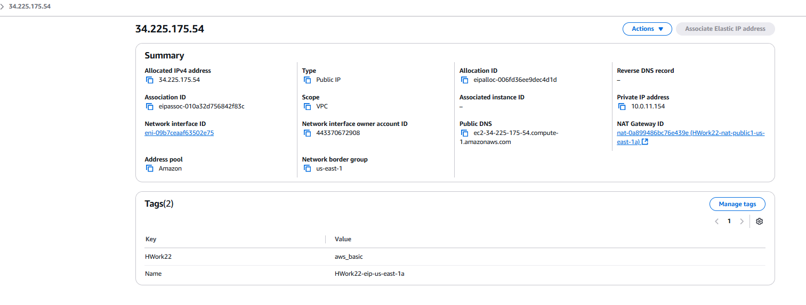


## Підключаємося до інстанса через клієнт SSH

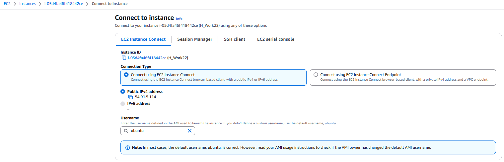
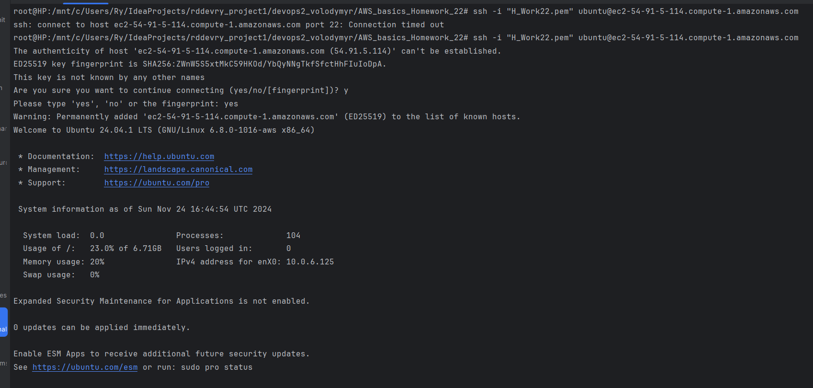
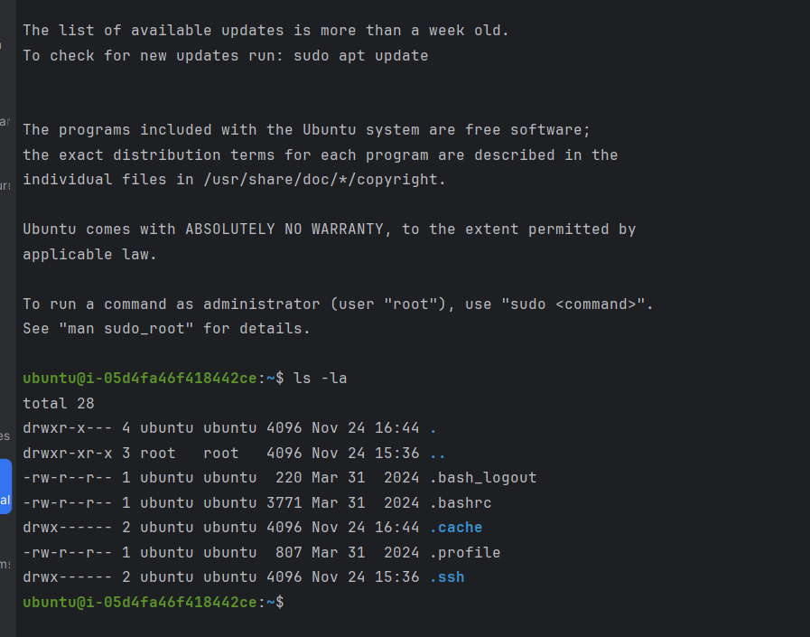
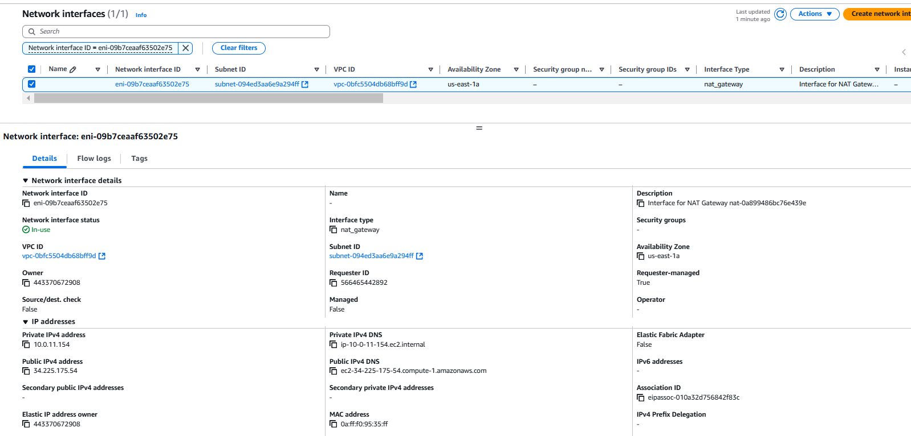

### Підсумки:
**Створено VPC** з CIDR блоком 10.0.0.0/16, включаючи публічну та приватну підмережі.
**Налаштовано інтернет-шлюз** та маршрутизацію для публічної підмережі.
**Безпека**: Створено Security Group для доступу через SSH та HTTP з будь-якої IP-адреси.
**Запуск EC2 інстансу** з Amazon Linux 2 в публічній підмережі та доступ через SSH.
**Еластична IP-адреса (EIP)** призначена до інстансу для постійного публічного доступу.

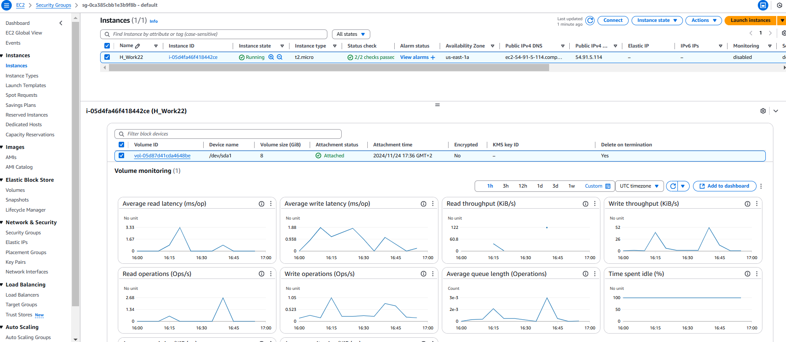
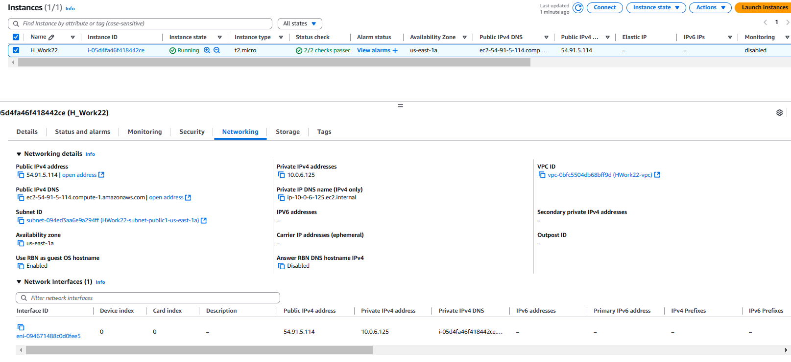
Ці кроки дозволяють забезпечити базову інфраструктуру для роботи з EC2 інстансами в AWS, забезпечуючи доступ до Інтернету та налаштування безпеки.
````