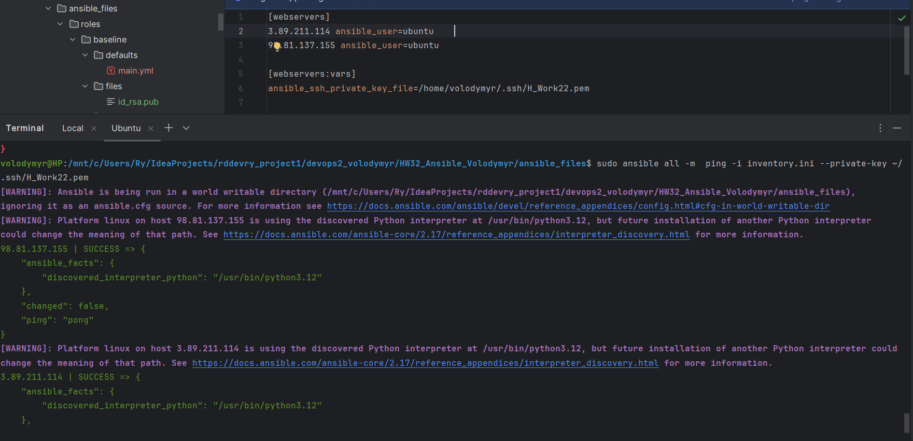
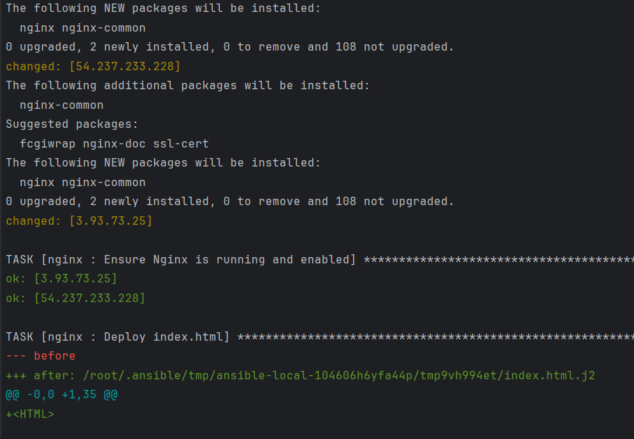
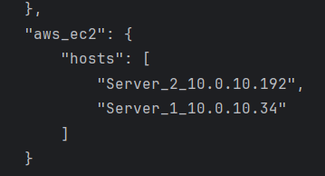

### [<log - Частина перша>](./log_1.md)

### [<log - Частина друга>](./log_2.md)

# AWS Ansible

Для отримання 2 `ec2 instance` використаємо `terraform` структуру, аналогічну стаореній в завданні 29-30:


### Створимо `playbook` з трьома ролями: `baseline`, `firewall` та `nginx`. 

Інвентар поки що використовуємо статичний. Динамічний інвентар буде налаштовано пізніше

### Структура каталогів:
```
.
├── playbook.yml
├── vars.yml
├── inventory.ini
└── roles
    ├── baseline
    │   ├── defaults
    │   │   └── main.yml
    │   ├── files
    │   │   └── id_rsa.pub
    │   ├── handlers
    │   │   └── main.yml
    │   ├── tasks
    │   │   └── main.yml
    │   └── vars
    │       └── main.yml
    ├── firewall
    │   ├── defaults
    │   │   └── main.yml
    │   ├── tasks
    │   │   └── main.yml
    │   └── vars
    └── nginx
        ├── tasks
        │   └── main.yml
        ├── templates
        │   └── index.html.j2
        └── vars
```



### 1. **Загальні файли:**

#### `playbook.yml`
```yml
---
- name: Налаштування серверів
  hosts: all
  become: true
  vars_files:
    - vars.yml

  roles:
    - baseline
    - firewall
    - nginx
```

#### `vars.yml`
```yml
---
ansible_user: ubuntu
group: admin
```

#### `inventory.ini`
```yml
[webservers]
54.85.120.10 ansible_user=ubuntu
23.20.107.157 ansible_user=ubuntu

[webservers:vars]
ansible_ssh_private_key_file=/home/volodymyr/.ssh/H_Work22.pem
```


### 2. **Роль `baseline` для налаштування SSH-ключів і встановлення базових пакетів (vim, git, mc, ufw)**

#### `roles/baseline/tasks/main.yml`
```yml
---
- name: Create user "{{ ansible_user }}"
  ansible.builtin.user:
    name: "{{ ansible_user }}"
    state: present
    shell: "/bin/bash"
    groups: "{{ group }}"

- name: Create "{{ group }}" user ssh directory
  ansible.builtin.file:
    path: "/home/{{ ansible_user }}/.ssh"
    state: directory
    owner: "{{ ansible_user }}"
    group: "{{ group }}"
    mode: 0700

- name: Ensure "{{ group }}" user auth_key file exist
  ansible.builtin.copy:
    content: ""
    dest: "/home/{{ ansible_user }}/.ssh/authorized_keys"
    owner: "{{ ansible_user }}"
    group: "{{ group }}"
    mode: 0600

- name: Add public keys into authorized_keys file for "{{ group }}" user
  ansible.builtin.lineinfile:
    path: "/home/{{ ansible_user }}/.ssh/authorized_keys"
    regexp: "{{ devops_public_item | regex_escape }}"
    line: "{{ devops_public_item }}"
  loop_control:
    loop_var: devops_public_item
  with_items:
    - "{{ devops_public_key }}"


#- name: add key for user "{{ username }}"
#  ansible.builtin.authorized_key:
#    user: "{{ username }}"
#    state: present
#    key: "{{ lookup('file', './files/id_rsa.pub') }}"


- name: Install baseline packages
  ansible.builtin.apt:
    name:
      - vim
      - git
      - mc
      - ufw
    state: present
    update_cache: true


- name: Disable root login and pass auth
  ansible.builtin.lineinfile:
    path: "/etc/ssh/sshd_config"
    regexp: "{{ item.orig }}"
    line: "{{ item.changed }}"
  with_items:
    - { orig: '^PermitRootLogin', changed: 'PermitRootLogin no' }
    - { orig: '^PasswordAuthentication', changed: 'PasswordAuthentication no' }
  notify: Restart SSH
```

#### `roles/baseline/defaults/main.yml`
```yml
---
username: ubuntu
group: admin
devops_public_key:
  - "ssh-rsa AAAAB3NzaC1yc2EAAAADAQABAAABgQC65kyrb8D2EvRyfDQACkMY//m7Uhlg/UocUmIQtf050zaKSK6K0cy739YZHAQ/RAAe1QWbrkjpcspEuIXGbZoXkO3xTmLPsqC7AuGlbAWUlntPYwP1MNdmV4f+BvK6J04spMnxYZ3TDhEbFwHHIkZmeFNbLRET0KyJhEFEpDJszlLoVdy/8XZX3wcK1nJpY1RcB0LNR/tdwZSDNAgqegdi/axKp3SV/0BgBmHBqED4fZ8N8FmEoMo+re0kmq4b2NGykzP2JyfODMxR6mxrZDM43MvyIl+LrOdHSFkOWnHb4/ut08l493bBjyEZwF+ZRaA7AuJB5Hetoq0cEGTGhIgACdOfMJSlclhwE1fQIuKf3E77dVGGkUmZP/37YypX+viaMbt+g0nxWmi26P1A1PDH8r29EPi4GNghAJp53qT6bjNFHMlG6T1D6lNIRztQIFOVLocwWa5/pn+Ov//2Wt5NeezvPhxdbtHslXRLGp2xYCXtlQZ4+R9lgEygy3IxIOM= volodymyr@HP"
  - "ssh-ed25519 AAAAC3NzaC1lZDI1NTE5AAAAIHDYxB4OGizlDML/UEBtYDVK0jsjKEGtX/FdaW/PtGt2 H_Work22"
```

#### `roles/baseline/handlers/main.yml`
```yml
---
- name: Restart SSH
  ansible.builtin.service:
    name: ssh
    state: restarted
```

#### `roles/baseline/vars/main.yml`
```yml
---
ansible_user: ubuntu
```


### 3. **Роль `firewall` для налаштування базових правил firewall за допомогою ufw**

#### `roles/firewall/tasks/main.yml`
```yml
---
- name: Set default firewall rules
  ansible.builtin.command: ufw default {{ ufw_default_policy }}

- name: Allow specified ports
  ansible.builtin.ufw:
    rule: allow
    port: "{{ item }}"
  loop: "{{ ufw_allowed_ports }}"

- name: Deny specified ports
  ansible.builtin.ufw:
    rule: deny
    port: "{{ item }}"
  loop: "{{ ufw_denied_ports }}"

- name: Enable UFW
  ansible.builtin.ufw:
    state: enabled
    log: "{{ ufw_logging }}"
```

#### `roles/firewall/defaults/main.yml`
```yml
---
ufw_default_policy: "deny incoming"
ufw_logging: "on"
ufw_allowed_ports:
  - "22"       # SSH
  - "80"       # HTTP
  - "443"      # HTTPS
ufw_denied_ports: []
```


### 4. **Роль `nginx` для встановлення Nginx та розгортання `index.html` з використанням шаблонів**

#### `roles/nginx/tasks/main.yml`
```yml
---
- name: Install Nginx
  ansible.builtin.apt:
    name: nginx
    state: latest

- name: Ensure Nginx is running and enabled
  ansible.builtin.service:
    name: nginx
    state: started
    enabled: yes

- name: Deploy index.html
  ansible.builtin.template:
    src: index.html.j2
    dest: /var/www/html/index.html
    owner: www-data
    group: www-data
    mode: '0644'
```

#### `roles/nginx/templates/index.html.j2`
```html
<HTML>
<HEAD>
    <TITLE>ADV-IT</TITLE>
    <SCRIPT LANGUAGE="JavaScript">
        var sizes = new Array(0, 1, 2, 4, 8, 10, 12);
        sizes.pos = 0;

        function Elastic() {
            var el
            document.all.elastic
            if (null el.direction) el.direction = 1
        else if ((sizes.pos > sizes.length - 2) || (0 == sizes.pos)) el.direction *= -1
            el.style.letterSpacing = sizes[sizes.pos + el.direction]
            setTimeout('Elastic ()', 100)
        }
    </SCRIPT>
</HEAD>
<BODY bgcolor="gray" onLoad=Elastic()>
<CENTER>
    <br>
    <br>
    <br>
    <br>
    <br>
    <br>
    <font color="pink">
        <H1 _ID="elastic" ALIGN="Center">Hello from {{ ansible_user }}</H1>
    </font>
    <font color="white"> Server Host Name: {{ ansible_hostname }}
        <br> Server OS Family: {{ ansible_os_family }}
        <br> Server IP Adderss: {{ ansible_default_ipv4.address }}
    </font>
</CENTER>
</BODY>
</HTML>
```



### 5. **Застосування dynamic inventory**

Додамо файл динамічного інвентарю `aws_ec2.yaml` і конфіг-файл `ansible.cfg` для його функціонування

#### `aws_ec2.yaml`
```yml
plugin: amazon.aws.aws_ec2
regions:
  - us-east-1
filters:
  instance-state-name: running
keyed_groups:
  - key: tags.Name
    separator: "_"
  - key: tags.role
    prefix: "role"
host_key_checks: false
compose:
  ansible_host: public_ip_address
```

#### `ansible.cfg`
```yml
[defaults]
force_color = true
any_errors_fatal = true
forks = 100
module_name = shell
retries = 5
host_key_checking = False
inventory = aws_ec2
ansible_python_interpreter = /usr/bin/python3

[inventory]
enable_plugins = amazon.aws.aws_ec2, yaml


# Uncomment to profile task runtime
#callbacks_enabled= ansible.builtin.default, ansible.posix.profile_tasks
## Options for callback plugins
show_task_path_on_failure = true
result_format= yaml
display_ok_hosts = true
display_skipped_hosts = false


[ssh_connection]
pipelining = yes
ssh_args = -o ControlMaster=auto -o ControlPersist=120s
```





### 6. **Використання Ansible Vault для шифрування конфіденційних даних**

Створимо зашифрований файл `vault.yml`

#### `vault.yml`
```yml
---
vault_data: encrypted_data
```

Для використання `vault.yml` додамо відповідні рядки до `playbook.yml` і `index.html.j2`


#### `playbook.yml`  (додали `- vault.yml` до `vars_files:`)
```yml
---
- name: Налаштування серверів
  hosts: all
  become: true
  vars_files:
    - vars.yml
    - vault.yml

  roles:
    - baseline
    - firewall
    - nginx
```


#### `roles/nginx/templates/index.html.j2`  (додали рядок `Vault information: {{ vault_data }}` знизу сторінки)
```html
<HTML>
<HEAD>
    <TITLE>ADV-IT</TITLE>
    <SCRIPT LANGUAGE="JavaScript">
        var sizes = new Array(0, 1, 2, 4, 8, 10, 12);
        sizes.pos = 0;

        function Elastic() {
            var el
            document.all.elastic
            if (null el.direction) el.direction = 1
        else if ((sizes.pos > sizes.length - 2) || (0 == sizes.pos)) el.direction *= -1
            el.style.letterSpacing = sizes[sizes.pos + el.direction]
            setTimeout('Elastic ()', 100)
        }
    </SCRIPT>
</HEAD>
<BODY bgcolor="gray" onLoad=Elastic()>
<CENTER>
    <br>
    <br>
    <br>
    <br>
    <br>
    <br>
    <font color="pink">
        <H1 _ID="elastic" ALIGN="Center">Hello from {{ ansible_user }}</H1>
    </font>
    <font color="white"> Server Host Name: {{ ansible_hostname }}
        <br> Server OS Family: {{ ansible_os_family }}
        <br> Server IP Adderss: {{ ansible_default_ipv4.address }}
        <br> Vault information: {{ vault_data }}
    </font>
</CENTER>
</BODY>
</HTML>
```


### 7. **Сконфігуруємо ще один playbook `playbook2.yml` для розгортання `firewall` на одному сервері, а `nginx` на інщому**:

#### `playbook2.yml`
```yml
---
- name: Setting up servers for ip-10-0-10-192.ec2.internal
  hosts: ip-10-0-10-192.ec2.internal
  become: true
  vars_files:
    - vars.yml

  roles:
    - baseline
    - firewall

- name: Setting up servers for ip-10-0-10-34.ec2.internal
  hosts: ip-10-0-10-34.ec2.internal
  become: true
  vars_files:
    - vars.yml
    - vault.yml

  roles:
    - baseline
    - nginx
```


### Після додавання усіх файлів маємо наступну структуру каталогів:
```
.
├── playbook.yml
├── playbook2.yml
├── vars.yml
├── vault.yml
├── inventory.ini
├── aws_ec2.yaml
├── ansible.cfg
└── roles
    ├── baseline
    │   ├── defaults
    │   │   └── main.yml
    │   ├── files
    │   │   └── id_rsa.pub
    │   ├── handlers
    │   │   └── main.yml
    │   ├── tasks
    │   │   └── main.yml
    │   └── vars
    │       └── main.yml
    ├── firewall
    │   ├── defaults
    │   │   └── main.yml
    │   ├── tasks
    │   │   └── main.yml
    │   └── vars
    └── nginx
        ├── tasks
        │   └── main.yml
        ├── templates
        │   └── index.html.j2
        └── vars
```