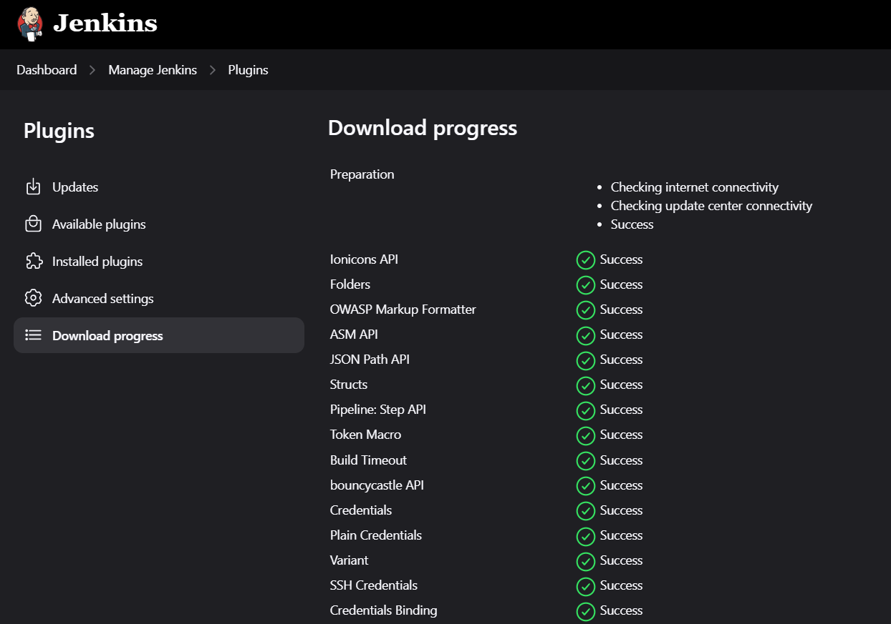
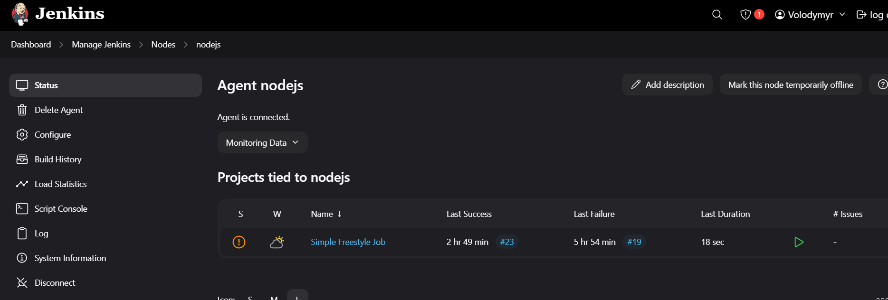
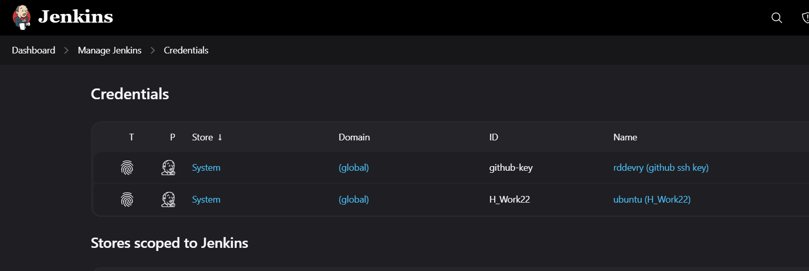
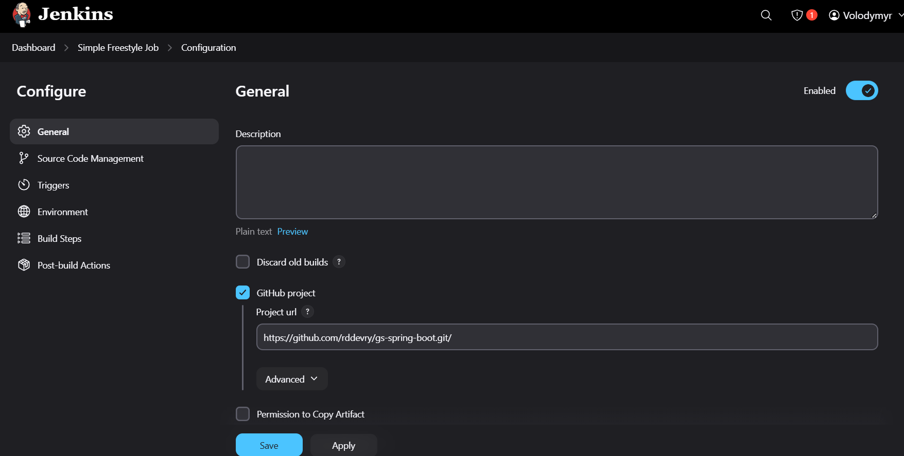
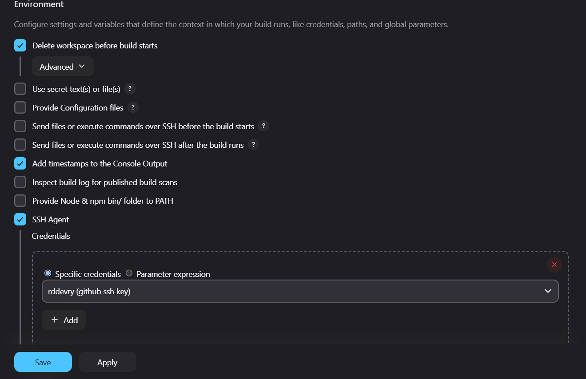

### [<log - Частина перша>](./log_1.md) (terraform + ansible)

### [<log - Частина друга>](./log_2.md) (продовження ansible)

# Jenkins

## Створимо і налаштуємо сервери

### Використовуючи надані матеріали, за допомогою `Terraform` створимо 3 `ec2 instance`: `jenkins_master`, `jenkins_worker` і `app_instance`


### Встановимо `Jenkins` на `jenkins_master`


### Створимо ansible-роль `maven` для встановлення Maven на наші сервери і застосуємо її, додавши до відповідних плейбуків.

#### Також встановлюємо Java і інші dependencies

#### `roles/maven/tasks/main.yml`
```yml
---
- name: Ensure required dependencies are installed
  apt:
    name: "{{ item }}"
    state: present
  with_items:
    - wget
    - tar
  become: yes

- name: Download Maven archive
  get_url:
    url: "https://dlcdn.apache.org/maven/maven-{{ maven_major_version }}/{{ maven_version }}/binaries/apache-maven-{{ maven_version }}-bin.tar.gz"
    dest: "/tmp/apache-maven-{{ maven_version }}-bin.tar.gz"

- name: Extract Maven archive
  unarchive:
    src: "/tmp/apache-maven-{{ maven_version }}-bin.tar.gz"
    dest: /opt
    remote_src: yes
  become: yes

- name: Create a symbolic link for Maven
  file:
    src: "/opt/apache-maven-{{ maven_version }}"
    dest: /opt/maven
    state: link
  become: yes

- name: Set Maven environment variables
  copy:
    dest: /etc/profile.d/maven.sh
    content: |
      export M2_HOME=/opt/maven
      export PATH=$M2_HOME/bin:$PATH
    owner: root
    group: root
    mode: '0644'
  become: yes


- name: Load Maven environment variables (if needed in playbook)
  shell: ". /etc/profile.d/maven.sh"
  become: yes
```

#### `roles/maven/defaults/main.yml`
```yml
---
# Default variables for the Maven role
maven_major_version: 3
maven_version: 3.9.4
```


## Налаштуємо `Jenkins`

### Встановимо на `Jenkins` всі необхідні плагіни





### Далі додамо до `Jenkins` `jenkins_worker` у якості worker node




### Також додамо ключі для `git` та серверів




## Створимо `Freestyle Project` з назвою `Simple Freestyle Job`

### Вона буде стягувати проєкт з репозиторію і розгортати його на `jenkins_worker`

### [<Посилання на лог виконання job-и>](./console_build.md)







### Додамо пересилання побудованого проєкту через `ssh` та його deploy на сервері `app_instance`

### [<Посилання на лог виконання job-и>](./console_deploy.md)


## Створимо `Pipeline Job` з назвою `pipeline`, яка робитиме те саме, що і попередня

### [<Посилання на лог виконання job-и>](./console_pipeline_build.md)

```Jenkinsfile
pipeline {
    agent { label 'nodejs'}

    parameters {
        string(name: 'REMOTE_USER', defaultValue: 'ubuntu', description: 'Remote user for SSH')
        string(name: 'REMOTE_HOST', defaultValue: '54.196.213.247', description: 'Remote host for SSH')
        string(name: 'DST_FOLDER', defaultValue: '/home/ubuntu/app', description: 'Destination folder on remote server')
    }

    environment {
        NODE_OPTIONS = '--max-old-space-size=4096'
    }

    stages {
        stage('Clone Repository') {
            steps {
                git branch: 'main', credentialsId: 'github-key', url: 'https://github.com/rddevry/gs-spring-boot.git'
            }
        }

        stage('Build with Maven') {
            steps {
                // Run Maven build
                sh 'mvn -f initial/pom.xml clean install'
            }
        }


        stage('Prepare Remote Directory') {
            steps {
                sshagent(credentials: ['H_Work22']) {
                    sh "ssh -o StrictHostKeyChecking=no ${params.REMOTE_USER}@${params.REMOTE_HOST} \"mkdir -p ${params.DST_FOLDER}\""
                }
            }
        }

        stage('Transfer Artifacts to EC2') {
            steps {
                sshagent(credentials: ['H_Work22']) {
                    // Use SCP to transfer the .jar file
                    sh """
                    scp -o StrictHostKeyChecking=no ${params.REMOTE_USER}@${params.REMOTE_HOST} /home/ubuntu/.m2/repository/com/example/spring-boot-initial/0.0.1-SNAPSHOT/spring-boot-initial-0.0.1-SNAPSHOT.jar ${params.REMOTE_USER}@${params.REMOTE_HOST}:${params.DST_FOLDER}
                    """
                }
            }
        }

        // stage('Transfer Files') {
        //     steps {
        //         sshagent(credentials: ['H_Work22']) {
        //             sh "scp -o StrictHostKeyChecking=no -r build/ package.json ${params.REMOTE_USER}@${params.REMOTE_HOST}:${params.DST_FOLDER}"
        //         }
        //     }
        // }


//         stage('Run Application on EC2') {
//             steps {
//                 sshagent(credentials: ['H_Work22']) {
//                     // Use SSH to execute commands on EC2
//                     sh """
//                     ssh -o StrictHostKeyChecking=no ${params.REMOTE_USER}@${params.REMOTE_HOST} << EOF
//                     cd ${DST_FOLDER}
//                     java -jar spring-boot-initial-0.0.1-SNAPSHOT.jar
//                     EOF
//                     """
//                 }
//             }
//         }
    }
}
```


