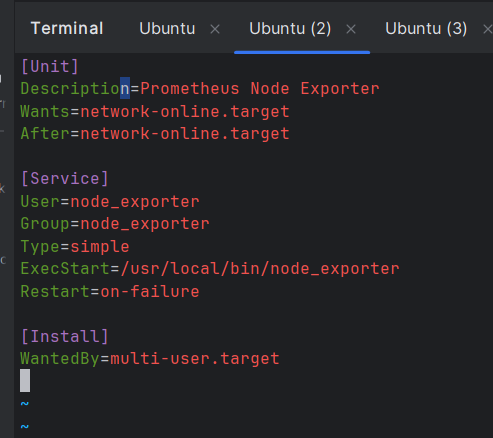

### [<log - terraform>](./log_terraform.md)

### [<log - monitoring_server>](./log_monitor.md)

### [<log - app_server>](./log_app.md)

# Monitoring

### Використовуючи надані матеріали, за допомогою `Terraform` створимо 2 `ec2 instance`: `monitoring` і `app_instance`

### Підключимося до створених серверів по `SSH` (для зручності зробимо це в двох окремих консолях)

### Встановимо на моніторинг-сервер `docker` і створимо конфіги для `prometheus`, `loki` і `docker-compose`

### Після цього можна налаштувати `grafana`

### Завантажимо на обидва сервери `prometheus node_exporter`

### Створимо для `node_exporter` юзера

### Створимо та запустимо від його імені відповідний процес

### Створимо на `app_server` скрипт `app.py`, логи якого зберігатимемо в `loki`. Встановимо неоюхідне ПЗ

### Тепер створимо на `app_server` агента для`loki`

#### Запустимо його в контейнері

### Тепер логи нашого застосунку на `app_server` можна переглядати через `monitoring_server`

