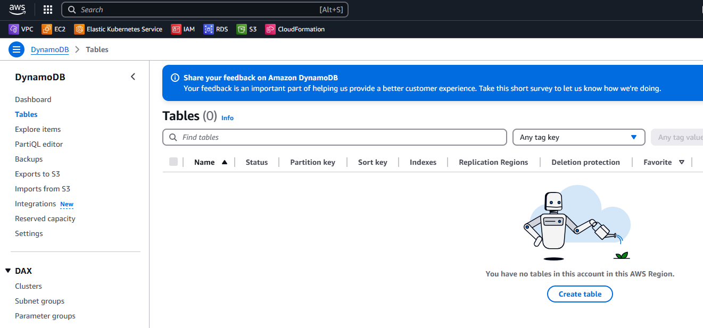
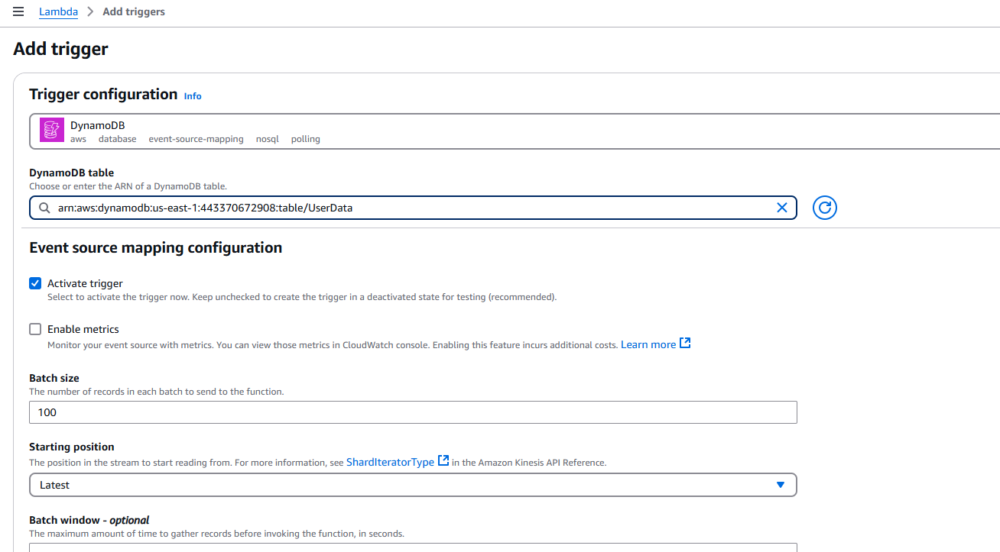

# AWS_Lambda

### Створимо таблицю `UserData` в `DynamoDB`

### Створимо роль для доступу лямбда функцій до `DynamoDB` та `SES`

### Створимо декілька функцій для роботи з таблицею `UserData`

### Налаштуємо  `DynamoDB stream`

### Створимо функцію `DynamoDB_monitor`, яка відсилатиме e-mail при змінах в таблиці `UserData`

### Протестуємо роботу функції 

