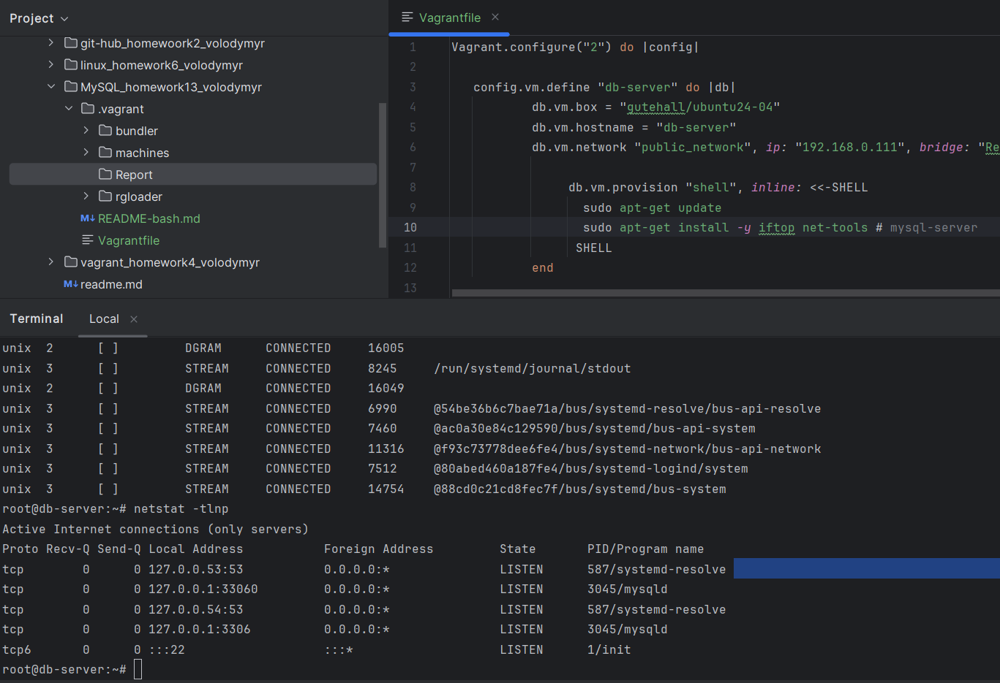
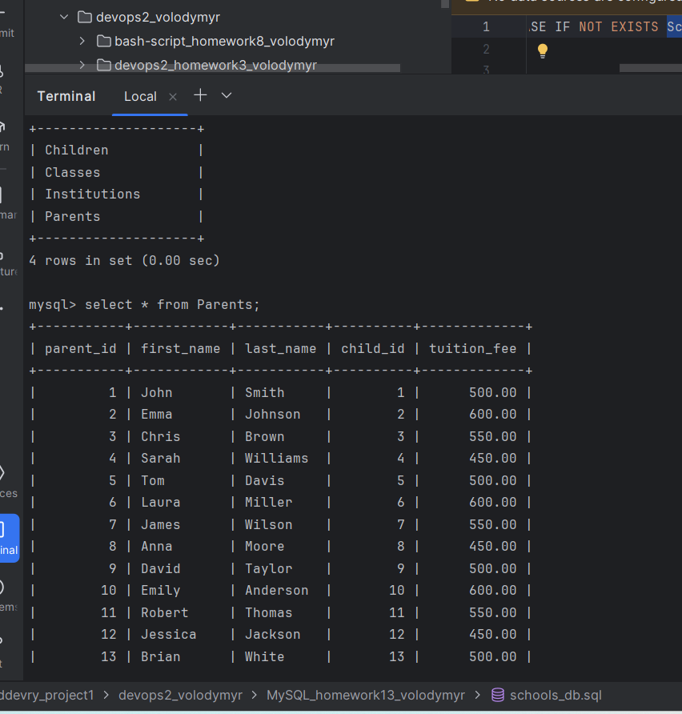

# Робота з SQL

[Посилання на початковий файл бази даних](./schools_db.sql)

[Посилання на доповнений та анонімізований файл бази даних](./schools1_db.sql)

### Запускаємо віртуальну машину використовуючи vagrant-файл

```ruby
Vagrant.configure("2") do |config|

config.vm.define "db-server" do |db|
db.vm.box = "gutehall/ubuntu24-04"
db.vm.hostname = "db-server"
db.vm.network "public_network", bridge: "Realtek RTL8822BE 802.11ac PCIe Adapter"

                db.vm.provision "shell", inline: <<-SHELL
                  sudo apt-get update
                  sudo apt-get install -y iftop net-tools # mysql-server
                 SHELL
           end


#   config.vm.define "bk-server" do |bk|
#           bk.vm.box = "gutehall/ubuntu24-04"
#           bk.vm.hostname = "backup-server"
#           bk.vm.network "public_network", ip: "192.168.0.110", bridge: "Realtek RTL8822BE 802.11ac PCIe Adapter"
#
#
#   end
end
```



### Змінюємо конфіг mysqld.cnf для можливості доступу до бази з зовнішнього ресурсу


### Запускаємо MySQL server


### Виконуємо написаний SQL-скрипт




### Налаштовуємо доступ для DBeaver


### Статично встановлена адреса db-server в вагрант файлі не дозволила маршрутизувати його в мережі
### роутера (бо на роутері DHCP-сервер не бачить машину зі статичниою адресою 192,168,0,111) тому
### використано динамічну адресу 192.168.0.108


### Робимо бекап бази даних


### Додатково вставляємо по 3 записи в кожну таблицю.


### Виводимо список всіх дітей разом із закладом, в якому вони навчаються, та напрямом навчання.


### Виводимо інформацію про батьків і їхніх дітей разом із вартістю навчання.


### Виводимо список всіх закладів з адресами та кількістю дітей.


### 


### Анонімізація таблиці Children, шляхом заміни всіх імена на "Child", а прізвищ на "Anonymous".


### Анонімізація решти таблиць шляхом заміни всіх імен та назв на псевдоніми і рандомізації оплати на навчання.


### 


