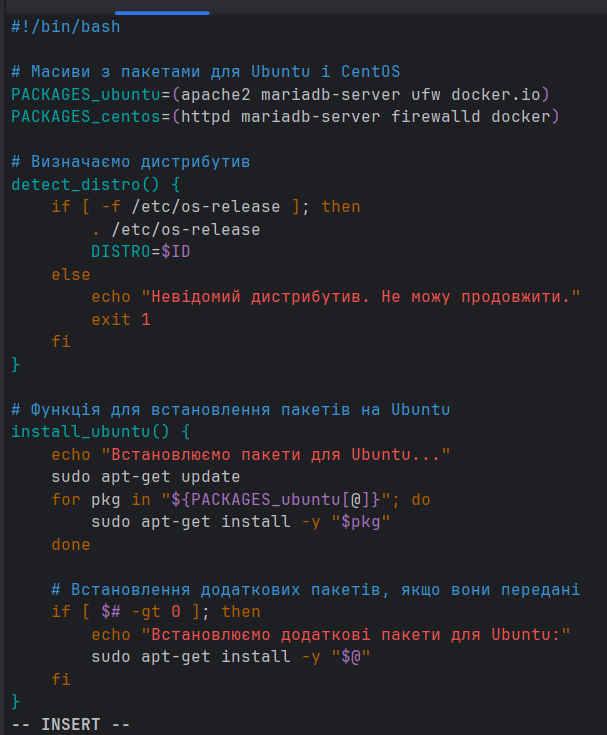

# Написання bash-скриптів

[Посилання на лог терміналу](./log-script-work_ubuntu-centos.txt)

### Пишемо `bash`-скрипт, який визначає дистрибутив `Linux` і, в залежності від нього, встановлює відповідні пакети, а також додаткові пакети, якщо вони передані в скрипт як аргумент.

````bash
#!/bin/bash

# Масиви з пакетами для Ubuntu і CentOS
PACKAGES_ubuntu=(apache2 mariadb-server ufw docker.io)
PACKAGES_centos=(httpd mariadb-server firewalld docker)

# Визначаємо дистрибутив
detect_distro() {
    if [ -f /etc/os-release ]; then
        . /etc/os-release
        DISTRO=$ID
    else
        echo "Невідомий дистрибутив. Не можу продовжити."
        exit 1
    fi
}

# Функція для встановлення пакетів на Ubuntu
install_ubuntu() {
    echo "Встановлюємо пакети для Ubuntu..."
    sudo apt-get update
    for pkg in "${PACKAGES_ubuntu[@]}"; do
        sudo apt-get install -y "$pkg"
    done

    # Встановлення додаткових пакетів, якщо вони передані
    if [ $# -gt 0 ]; then
        echo "Встановлюємо додаткові пакети для Ubuntu:"
        sudo apt-get install -y "$@"
    fi
}

# Функція для встановлення пакетів на CentOS
install_centos() {
    echo "Встановлюємо пакети для CentOS..."
    sudo yum update -y
    for pkg in "${PACKAGES_centos[@]}"; do
        sudo yum install -y "$pkg"
    done

    # Встановлення додаткових пакетів, якщо вони передані
    if [ $# -gt 0 ]; then
        echo "Встановлюємо додаткові пакети для CentOS:"
        sudo yum install -y "$@"
    fi
}

# Основна функція
main() {
    detect_distro

    case "$DISTRO" in
        ubuntu)
            install_ubuntu "$@"
            ;;
        centos)
            install_centos "$@"
            ;;
        *)
            echo "Дистрибутив $DISTRO не підтримується."
            exit 1
            ;;
    esac
}

# Викликаємо основну функцію з переданими аргументами
main "$@"
````

### Для машини `vm1` з дистрибутивом `Ubuntu` скрипт викликається у `Vagrant`-файлі при ініціалізації машини.


Можна побачити як встановлюється `apache`


Встановлюється `mariadb-server`


`ufw` останньої версії вже встановлений, встановлюється `docker`


### Для машини `vm2` з дистрибутивом `CentOS` спочатку необхідно замінити списки репозиторіїв на актуальні.


### Після цього можна скопіювати скрипт на машину і запустити його




Можна побачити як встановлюється `apache`


Встановлюється `mariadb-server`


Пакет `firewalld` останньої версії вже встановлений


Встановлюється `docker`


### Додатково встановимо пакет `nginx`, запустивши скрипт ще раз з відповідним аргументом


