1. **Встановлення VirtualBox**:
1. Завантажив та встановив останню версію VirtualBox з офіційного сайту (<https://www.virtualbox.org/>).
1. Створення  нової віртуальну машини з наступними параметрами:
1. Назва: TestVM, Тип: Linux, Версія: Ubuntu (64-bit), RAM VM 2 ГБ, HDD 20 ГБ у форматі VDI (VirtualBox Disk Image). CPU на 2 ядра.

   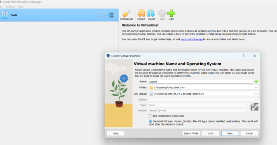

   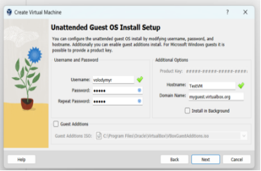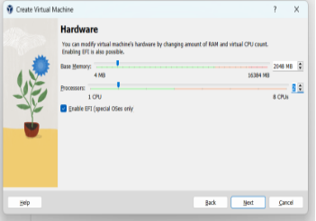

   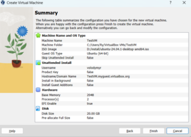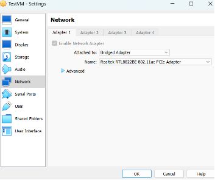

1. Активовано опцію Enable EFI (special OSes only).

   Збільшено RAM 4GB, core cpu 4

   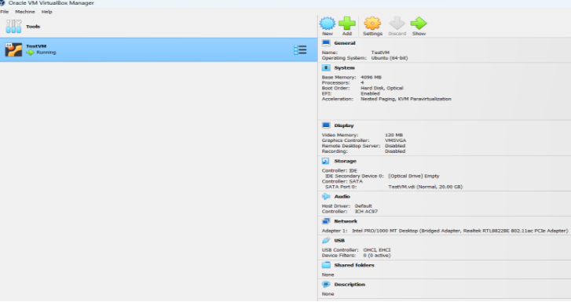

   Мережевий адаптер налаштований на тип Bridged Adapter, щоб VM могла отримати IP-адресу з локальної мережі. Адаптер отримав адресу 192.168.0.104 з локального мережевого роутеру по DHCP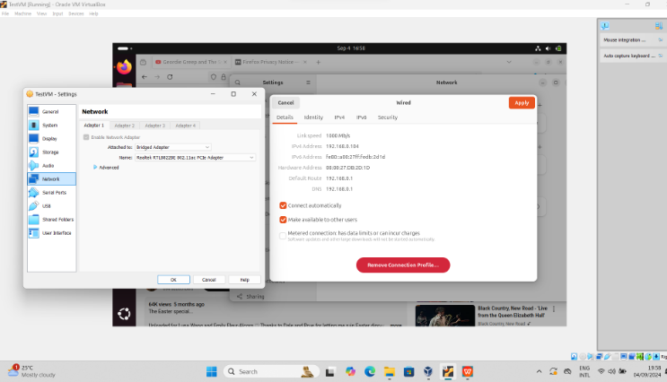

   **Інсталяція операційної системи**:

1. ЗавантаживISO-образ Ubuntu ubuntu-24.04.1-desktop-amd64.iso з офіційного сайту.
1. Виконав інсталяцію Ubuntu на VM додавши ораз VM як оптичний диск.

   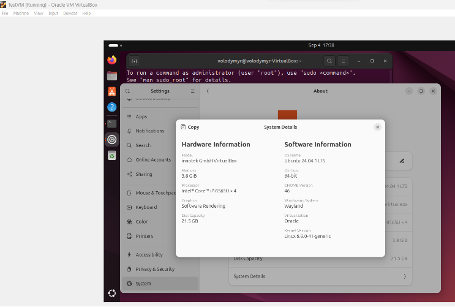
   **

   **Збереження та відновлення стану VM**:

1. Створив (snapshot) VM після налаштування системи .
1. Створив пусту папку
1. 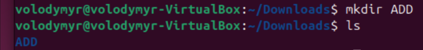

   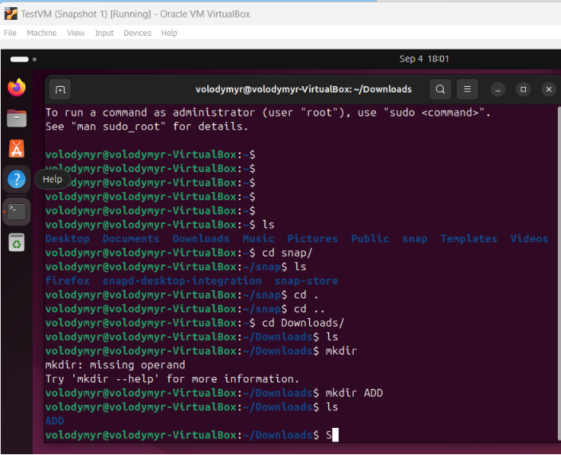

   ` `відновив VM до попереднього знімку. Переконався що створена папка зникла

   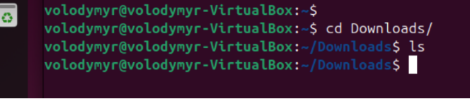

   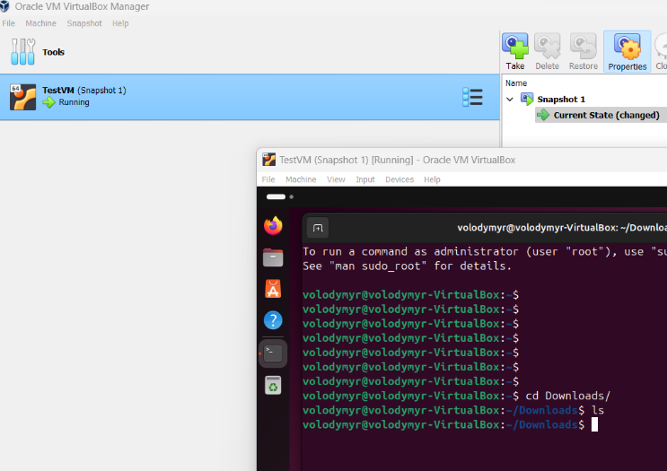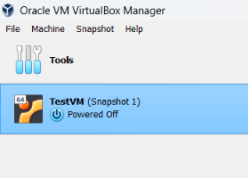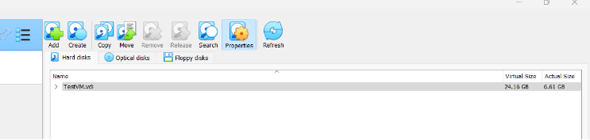

1. налаштування VM,  розділ Storage, виберіть диск і натисніть на кнопку Resize. Встановіть новий розмір диску (24 ГБ).

1. В даному вікні збільшив розмір диску TestVM.vdi до 24GB

   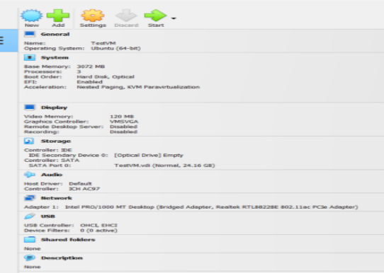

   ` `зміни розміра диску до 24 GB  не вплинули на працездатність системи.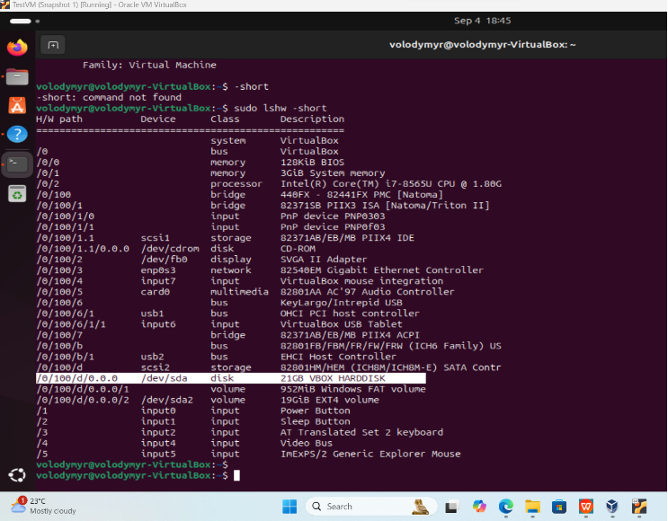

   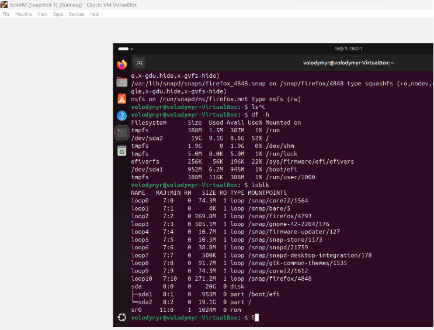

   Налаштування спільніих папок між основною машиною і VM, щоб мати можливість обмінюватися файлами між ними:

   **В VirtualBox**  інсталюємо  **набір драйверів і системних програм, що інсталюються в гостьовій системі**  **Guest Additions for better functionality**

   **Добавляємо користувача volodymyr** 

   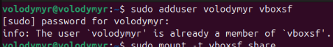

   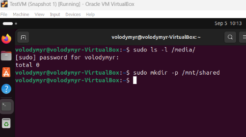

   У VM virtualBox Manager проводимо налаштування для поєднаних (розшарених у ОС Віндоффс та Убунту) папок

   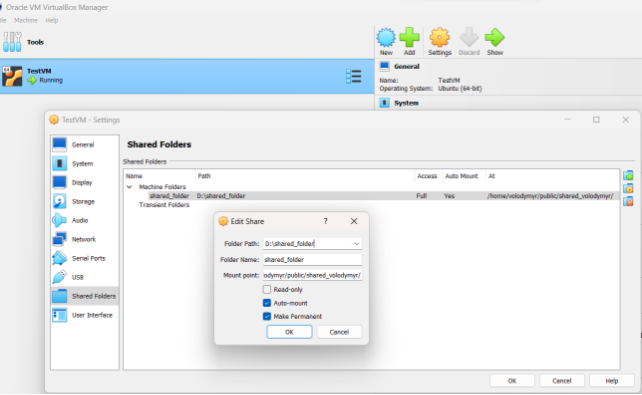

   В результаті : файл 1.txt створений в гостьовій ОС ubuntu ( з вмістом hello world) доступний в хостовій ОС Віндоффс.

   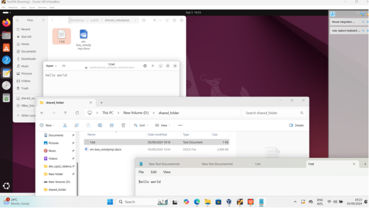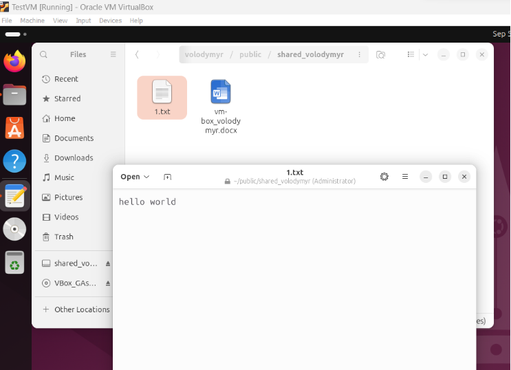
