:
## DOCKER COMPOSE   


### _>> [<log_docker-compose>](./log_docker-compose.md)

###   multi-container-app  новий каталог для проєкту docker-compose
* В ньому каталоги db-data web-data для серверів nginx postgresql з 
відповідними docker файлами

### Dockerfile nginx
 ```
FROM nginx:latest

COPY ./index.html /usr/share/nginx/html/index.html
 ```

### Dockerfile postgresql
 ```
FROM postgres:latest

ENV POSTGRES_USER=user
ENV POSTGRES_PASSWORD=password
ENV POSTGRES_DB=school_db

COPY ./school_db.sql /docker-entrypoint-initdb.d/school_db.sql
 ```
файл index.html додаємо до web-data :
 ``` html
<!DOCTYPE html>
<html>
<head>
    <title>My Docker App</title>
</head>
<body>
<h1>Hello from Docker!</h1>
</body>
</html>
 ```
2. Створюємо docker-compose.yml файл:
* У цьому файлі буде визначено конфігурацію для вебсервера, бази даних та кешу
* Додаємо до docker-compose.yml файлу образи nginx, postgres та redis
* Додаємо volume db-data для postgresql, та web-data для nginx
* та спільну мережу appnet

 ```
* version: '3.8'

services:
db:
build:
context: ./db-data
environment:
POSTGRES_USER: user
POSTGRES_PASSWORD: password
POSTGRES_DB: school_db
volumes:
- ./db-data/school_db.sql:/docker-entrypoint-initdb.d/school_db.sql
networks:
- appnet

web:
build:
context: ./web-data
ports:
- "0:80"
volumes:
- ./web-data:/usr/share/nginx/html
networks:
- appnet

cache:
image: redis:latest
networks:
- appnet

volumes:
db-data:
web-data:

networks:
appnet:
```
*


 ### Запуск багатоконтейнерного застосунку
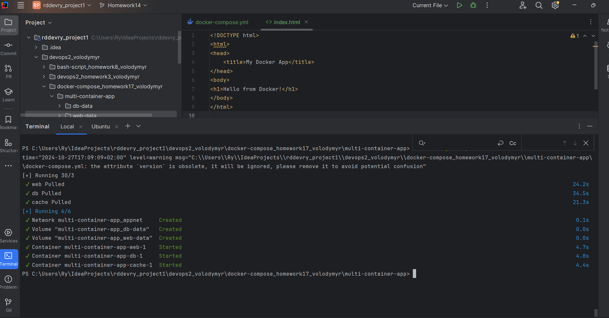
### Запускаємо застосунок за допомогою Docker Compose:
 команда docker-compose up -d для запуску всіх сервісів у фоновому режимі не наш спосіб :)
   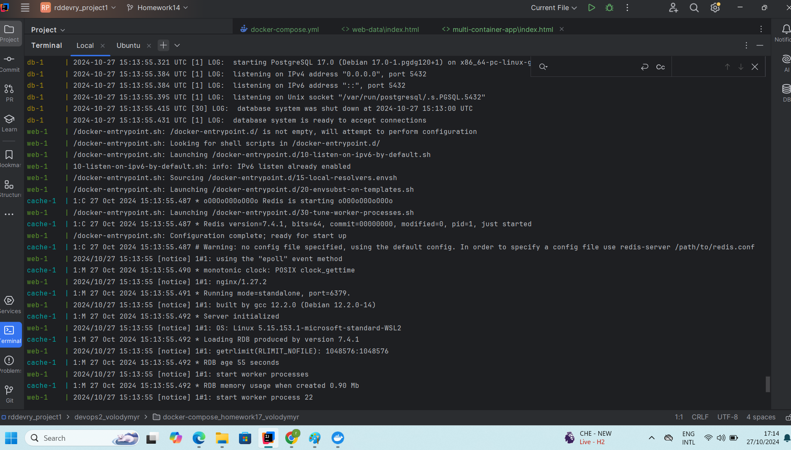
### Перевірка стану запущених сервісів:
команду docker-compose ps для перегляду стану запущених контейнерів

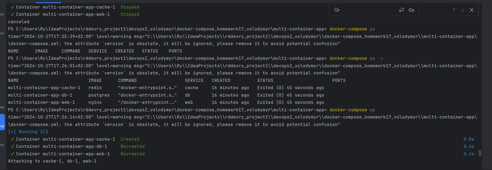
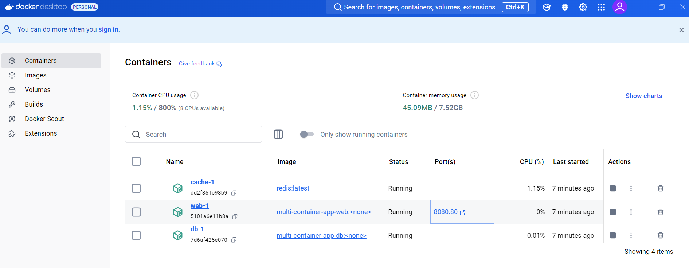
### робота вебсервера:
* за адресою http://localhost:8080. сторінка nginx.
  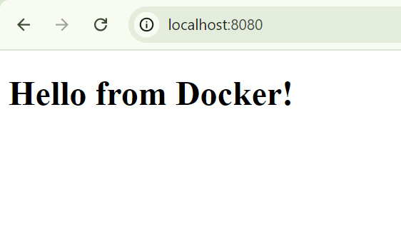
* 
### Налаштування мережі й томів


#### команди docker network ls та docker volume ls для перегляду створених мереж і томів
* 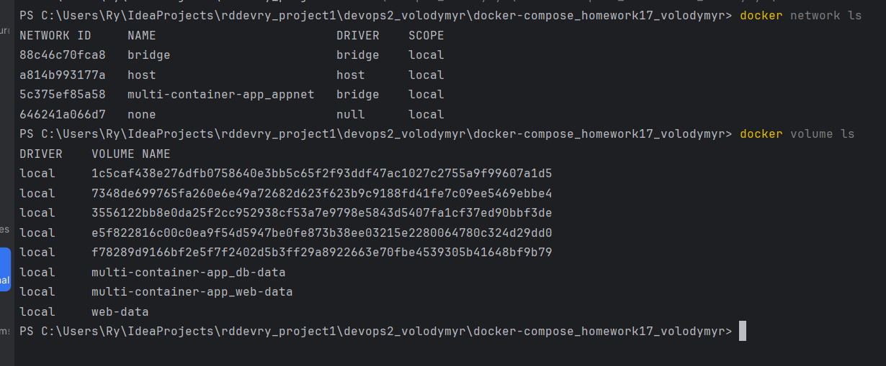
### підключення до бази даних:
  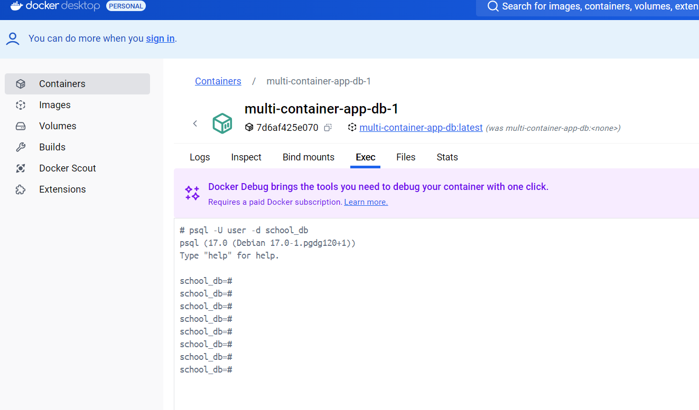
  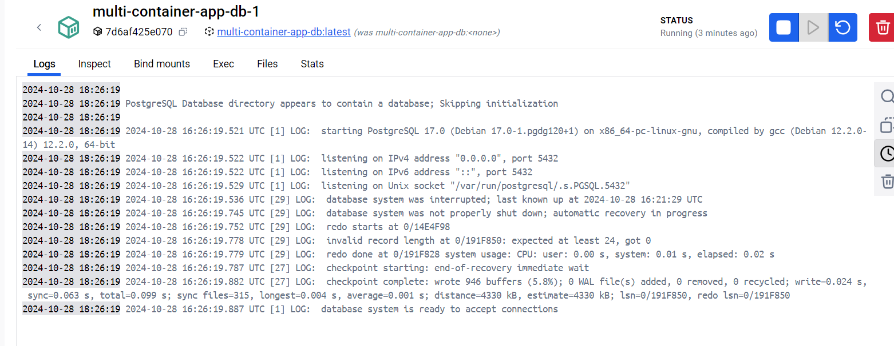

### команда docker exec для підключення до бази даних PostgreSQL всередині контейнера.
#### <db_container_id> можна отримати з команди docker-compose ps.
  
* 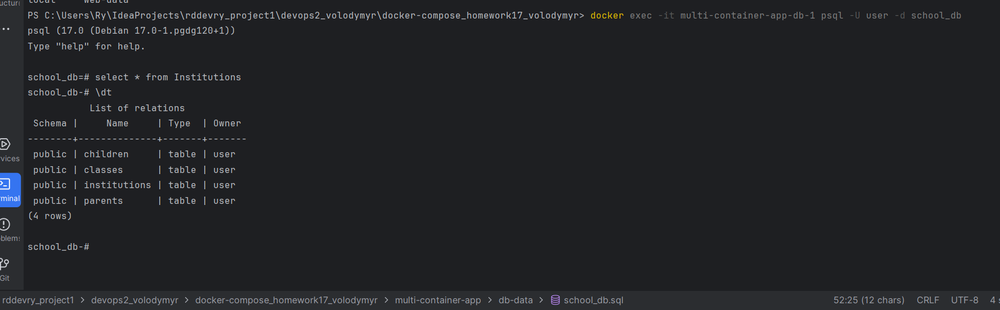

### Масштабування сервісів
#### Для того, щоби контейнери не конфліктували при взаємодії по портам,
#### в docker-compose файлі замість "8080:80" пишемо:
```
ports:
- "0:80"
```
#### команда docker-compose up -d --scale web=3 для запуску трьох екземплярів вебсервера
  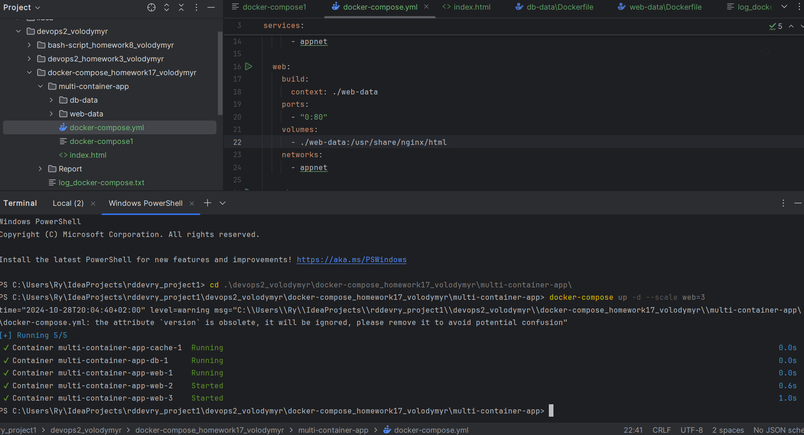

### Перевірка стану масштабованих сервісів:
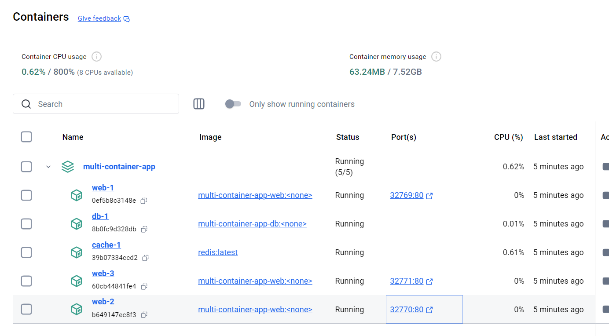

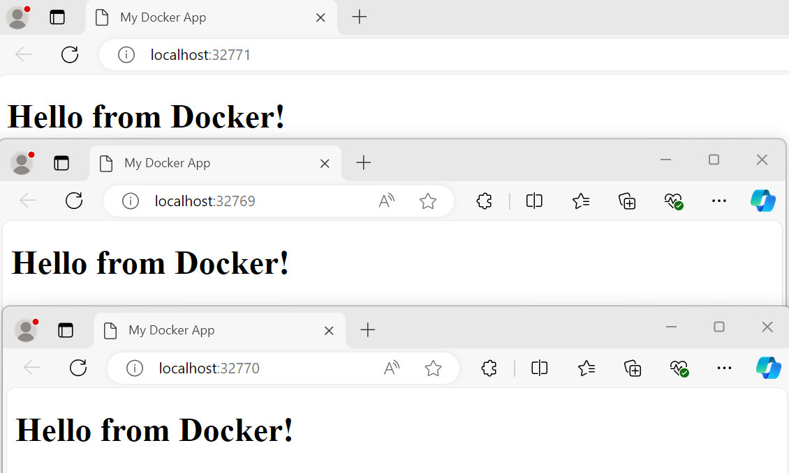
####  docker-compose ps для перегляду стану запущених контейнерів


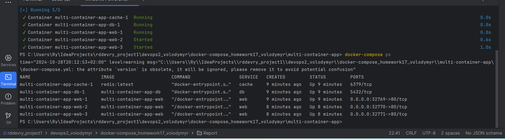


