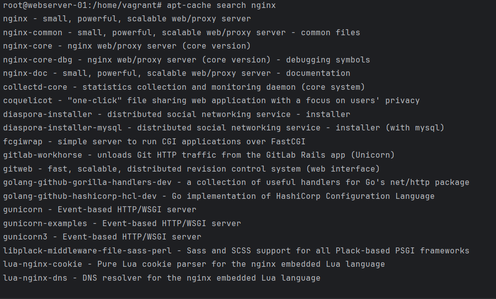
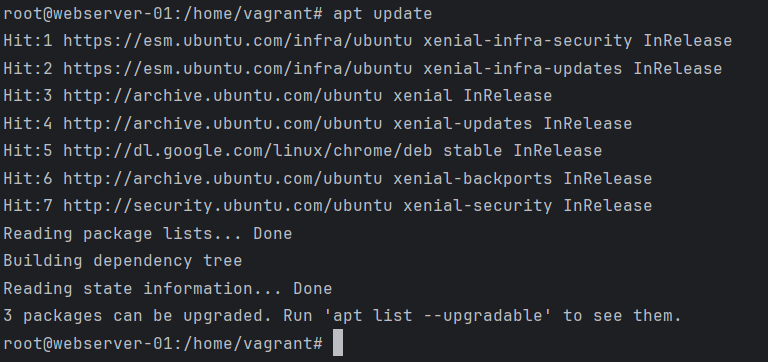
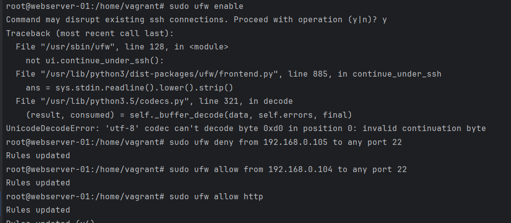
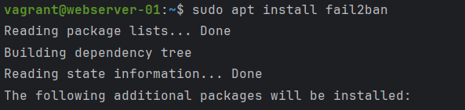

# Advanced Linux

## 1. Робота з репозиторіями

Додаємо ключ до репозиторію

Виводимо списки репозироріїв

Додаємо новий репозирорій до нового сиску репозиторіїв

Оновлюємо список репозиторіїв

Пакет nginx встановлено з офіційного репозиторію

Виводимо дані про встановлений пакет nginx

Виводимо дані про всі залежні пакети

Список наявних репозиторіїв

Додаємо ppa-репозиторій nginx

Оновлюємо список репозиторіїв

Було додано репозиторій  `http://ppa.launchpad.net/nginx/stable/ubuntu xenial/main`

Видаляємо репозиторій  `http://ppa.launchpad.net/nginx/stable/ubuntu xenial/main`

## 2. Робота зі скриптами й процесами

   Пишемо bash-скрипт `/opt/time_script.sh` , що записуватиме поточний час в лог кожні `15 секунд`

   

   

   Створюємо сервіс, що викликатиме наш скрипт

   

   

   Запускаємо та вимикаємо відповідний процес

   

   В результаті маємо наступний лог

   

## 3. Налаштування брандмауера за допомогою UFW

Заборонити доступ до порту `22 (SSH)` з певного IP, але дозволити з іншого IP.

Заборона доступ до порту `22` для IP-адреси `192.168.0.105`

Дозвіл доступу до порту `22` для IP-адреси `192.168.0.104`

При цьому дозволено в мережі трафік `http`

Status ufw

Стан мережі та наслідки впроваджених обмежень

### Налаштування Fail2Ban для захисту від підбору паролів через SSH.

Встановлення пакету `Fail2Ban`, створення і редагування відповідного розділу файлу `/etc/fail2ban/jail.local`

Спроби увійти по ssh з машини з неправильним ім’ям та паролем

Стан лічильників sshd змінюється

При цьому в файлі `/var/log/auth.log` спостерігаємо відповідні записи при спробі  авторизації по `ssh` користувача `fakeuser  ip:192.168.0.104`

## 4. Монтування диску на віртуальну машину

### Створюємо й монтуємо новий розділ на диску, налаштовуємо його для автоматичного монтування під час завантаження системи

Перелік наявного дискового простору і розділів до монтування нового диску

Створення нового диску `Disk /dev/sdc: 3 GiB`

Перелік розділів і дискового простору після створення нового диску

Монтування нового диску і налаштування автоматичного монтування диску при запуску машини

