# Робота з MongoDB

## [<Посилання на лог>](./log-mongo_db.md)

### Встановлення необхідного софту

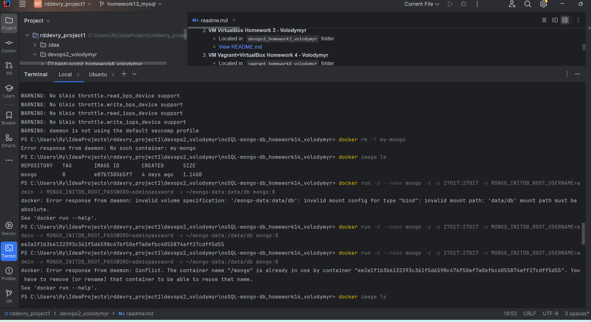

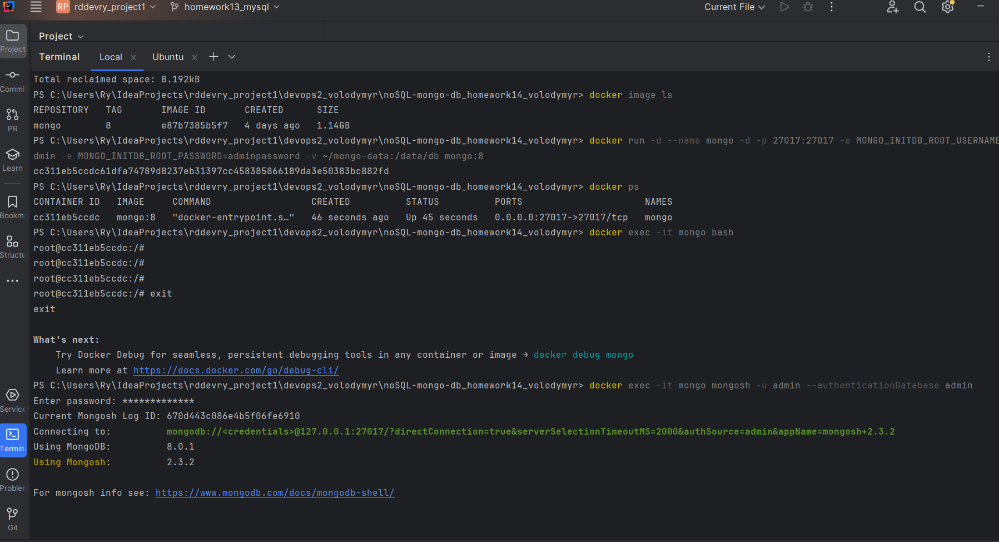

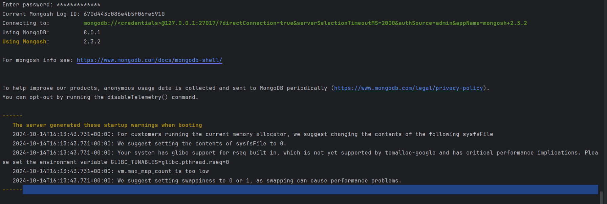

### 1. Створення бази даних та колекцій

Підключення до MongoDB та виконання команди для створення бази даних `gymDatabase` та колекцій: `clients`, `memberships`, `workouts`, `trainers`:

```
use gymDatabase;
```

### 2. Визначення схеми документів та додавання даних

### Колекція `clients`

Додамємо п'ять записів до колекції `clients`:

```javascript
db.clients.insertMany([
    { client_id: 1, name: "John Doe", age: 35, email: "john@example.com" },
    { client_id: 2, name: "Jane Smith", age: 28, email: "jane@example.com" },
    { client_id: 3, name: "Mike Johnson", age: 42, email: "mike@example.com" },
    { client_id: 4, name: "Emily Brown", age: 31, email: "emily@example.com" },
    { client_id: 5, name: "Chris Green", age: 25, email: "chris@example.com" }
]);
```

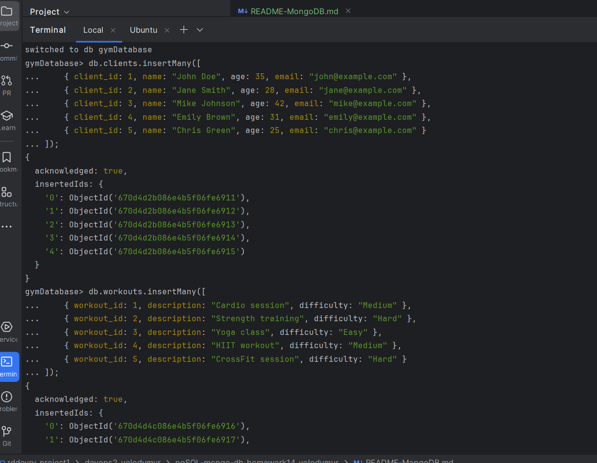

### Колекція `memberships`

 п'ять записів до колекції `memberships`:

```javascript
db.memberships.insertMany([
    { membership_id: 1, client_id: 1, start_date: "2024-01-01", end_date: "2024-12-31", type: "Annual" },
    { membership_id: 2, client_id: 2, start_date: "2024-06-01", end_date: "2024-12-01", type: "Semi-Annual" },
    { membership_id: 3, client_id: 3, start_date: "2024-03-15", end_date: "2025-03-15", type: "Annual" },
    { membership_id: 4, client_id: 4, start_date: "2024-05-01", end_date: "2024-11-01", type: "Semi-Annual" },
    { membership_id: 5, client_id: 5, start_date: "2024-08-01", end_date: "2025-08-01", type: "Annual" }
]);
```

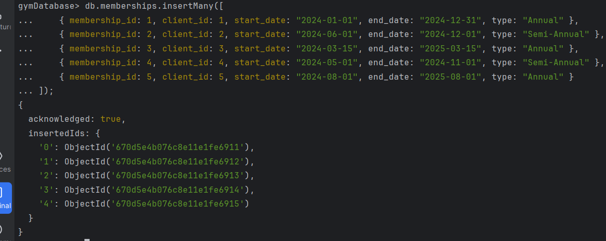

### Колекція `workouts`

 п'ять записів до колекції `workouts`:

```javascript
db.workouts.insertMany([
    { workout_id: 1, description: "Cardio session", difficulty: "Medium" },
    { workout_id: 2, description: "Strength training", difficulty: "Hard" },
    { workout_id: 3, description: "Yoga class", difficulty: "Easy" },
    { workout_id: 4, description: "HIIT workout", difficulty: "Medium" },
    { workout_id: 5, description: "CrossFit session", difficulty: "Hard" }
]);
```


### Колекція `trainers`

 п'ять записів до колекції `trainers`:

```javascript
db.trainers.insertMany([
    { trainer_id: 1, name: "Alice", specialization: "Cardio" },
    { trainer_id: 2, name: "Bob", specialization: "Strength" },
    { trainer_id: 3, name: "Charlie", specialization: "Yoga" },
    { trainer_id: 4, name: "David", specialization: "HIIT" },
    { trainer_id: 5, name: "Eve", specialization: "CrossFit" }
]);
```

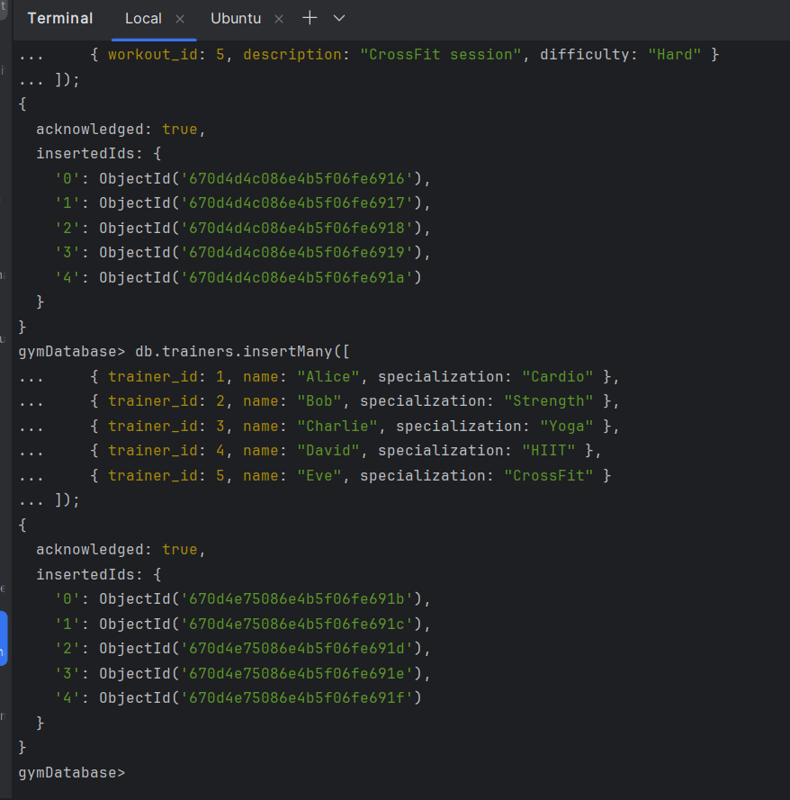

### 3. Запити до бази даних

### Запит 1: Знаходимо всіх клієнтів віком понад 30 років

```javascript
db.clients.find({ age: { $gt: 30 } });
```

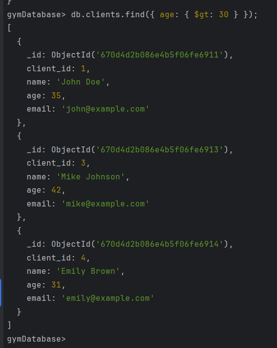

### Запит 2: Перелічимо тренування із середньою складністю

```javascript
db.workouts.find({ difficulty: "Medium" });
```

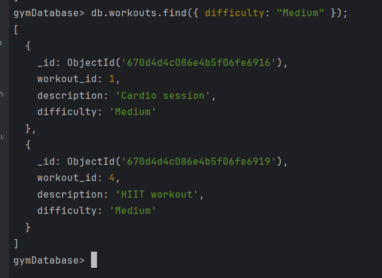

### Запит 3: Показ інформації про членство клієнтів з `client_id` більше ніж 3:

```javascript
db.clients.find({ client_id: { $gt: 3 } });
```

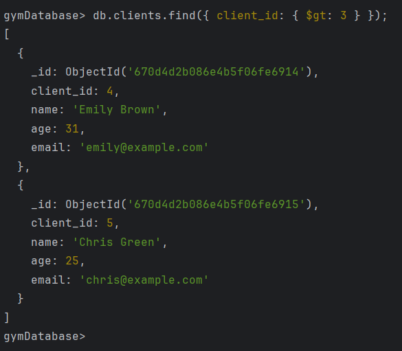

### Результат роботи з контейнером

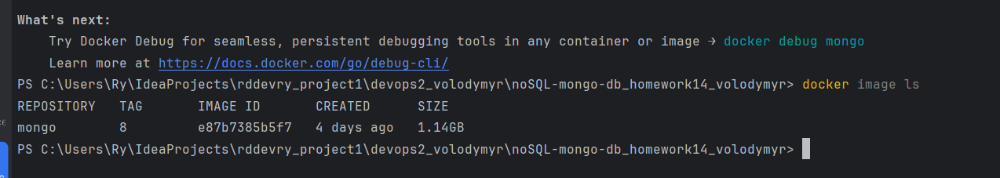

### вигляд gymDatabase MongoDB Compass


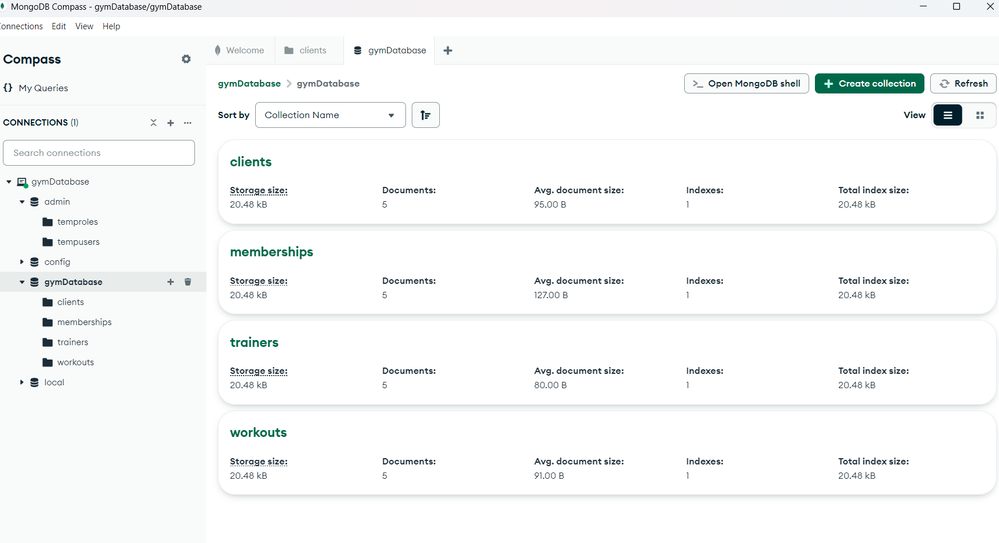

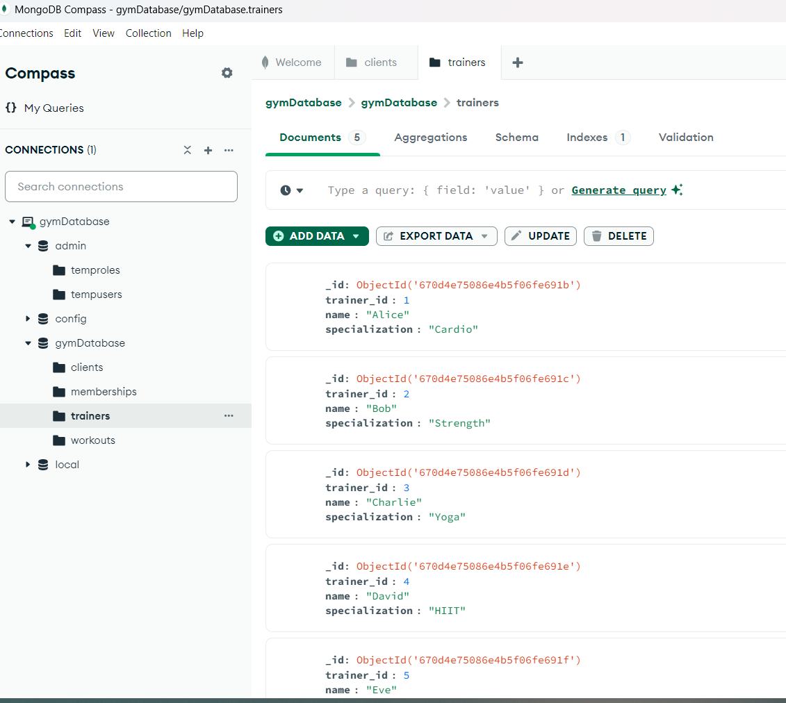

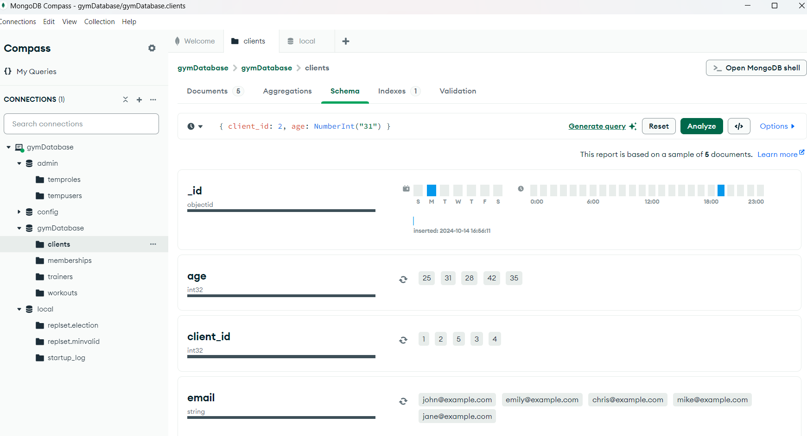


### Копіюємо дамп gymDatabase MongoDB
### ..\devops2_volodymyr\noSQL-mongo-db_homework14_volodymyr> docker cp mongo:/tmp/dump .


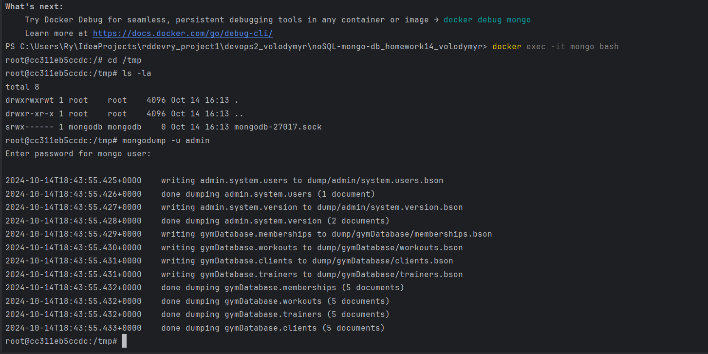

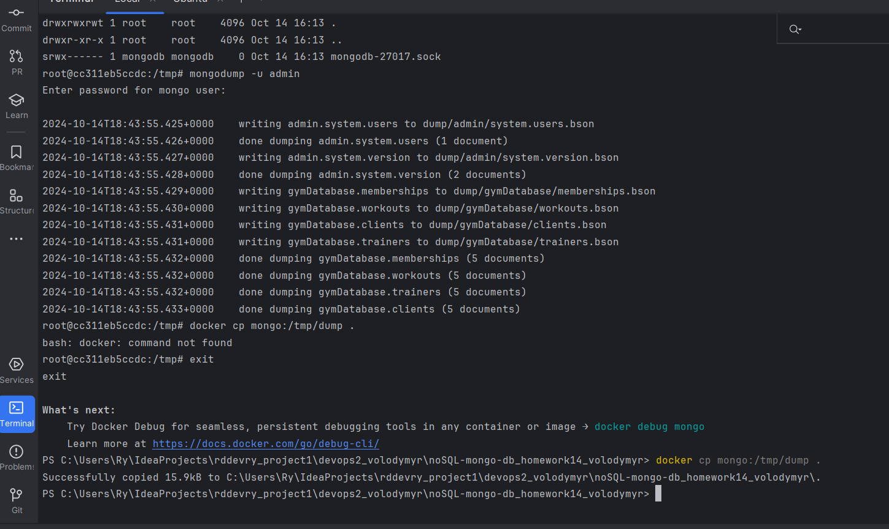
