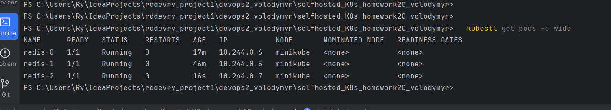

## Selfhosted K8s

### _>> [<k8s_log.md>](./k8s_log.md)

### Встановлення й налаштування Minikube на VirtualBox

1. **Вснатовлюємо Minikube**
   

2. **Додаємо його в шлях**
   

3. **Запуск Minikube**:
   Тепер, коли VirtualBox і Minikube встановлені, можна запустити кластер Minikube:
   ```bash
   minikube start --driver=virtualbox
   PS C:\Users\Ry\IdeaProjects\rddevry_project1\devops2_volodymyr\selfhosted_K8s_homework20_volodymyr> minikube start --driver=virtualbox --no-vtx-check
   ```

4. **Перевірка запуску Minikube**:
    Kubernetes кластер:
   ```bash
   kubectl cluster-info
   ```
   


---

### Завдання 1: Створення Redis StatefulSet

####  1: Створення PersistentVolumeClaim (PVC)
Для зберігання даних Redis, кожен под у StatefulSet буде використовувати окремий PersistentVolume. Це дозволяє забезпечити збереження даних при перезапусках подів.

```yaml
apiVersion: v1
kind: PersistentVolumeClaim
metadata:
  name: redis-data
spec:
  accessModes:
    - ReadWriteOnce
  resources:
    requests:
      storage: 1Gi
  storageClassName: standard
```

#### 2: Створення StatefulSet для Redis
StatefulSet дозволяє створити декілька реплік Redis із стабільними іменами та доступом до окремих томів.

```yaml
apiVersion: apps/v1
kind: StatefulSet
metadata:
  name: redis
spec:
  serviceName: "redis"
  replicas: 2
  selector:
    matchLabels:
      app: redis
  template:
    metadata:
      labels:
        app: redis
    spec:
      containers:
      - name: redis
        image: redis:latest
        ports:
        - containerPort: 6379
        volumeMounts:
        - name: redis-data
          mountPath: /data
  volumeClaimTemplates:
  - metadata:
      name: redis-data
    spec:
      accessModes:
        - ReadWriteOnce
      resources:
        requests:
          storage: 1Gi
```

#### 3: Створення Service для Redis
Ми створюємо `Service` типу `ClusterIP`, щоб забезпечити внутрішній доступ до Redis між подами.

```yaml
apiVersion: v1
kind: Service
metadata:
  name: redis
spec:
  clusterIP: None
  selector:
    app: redis
  ports:
    - port: 6379
      targetPort: 6379
```

#### 4: Застосування конфігурацій
Щоб застосувати конфігураційні файли до Kubernetes, використовуємо наступні команди:

PersistentVolumeClaim:
   ```bash
   kubectl apply -f pvc.yaml
   ```

StatefulSet:
   ```bash
   kubectl apply -f statefulset.yaml
   ```

Service:
   ```bash
   kubectl apply -f service.yaml
   ```


####  5: Перевірка роботи
Після того як ми застосували конфігурації, перевіряємо, як працюють поди:
  
   Перевіряємо статус подів:
   ```bash
   kubectl get pods
   ```
   

   Дивимося на імена подів, які мають вигляд `redis-0`, `redis-1`.

   
   
   Підключаємося до першого пода:
   ```bash
   kubectl exec -it redis-0 -- redis-cli
   ```

   Потім додаємо деякі дані:
   ```bash
   set mykey "somevalue"
   ```
   

   Перевіряємо, чи дані зберігаються після перезапуску пода:
   ```bash
   kubectl delete pod redis-0
   kubectl exec -it redis-0 -- redis-cli get mykey
   ```
   

   Також спробуємо змінити кількість подів шляхом редагування файліу `statefulset.yaml`.

   

   

   

---

### Завдання 2: Налаштування Falco за допомогою DaemonSet


#### Створення DaemonSet для Falco

Необхідна YAML-конфігурація:

```yaml
apiVersion: apps/v1
kind: DaemonSet
metadata:
  name: falco
  namespace: kube-system
spec:
  selector:
    matchLabels:
      app: falco
  template:
    metadata:
      labels:
        app: falco
    spec:
      containers:
        - name: falco
          image: falcosecurity/falco:latest
          securityContext:
            privileged: true  # Привілейований доступ для моніторингу системних викликів
          volumeMounts:
            - name: proc
              mountPath: /host/proc
              readOnly: true
            - name: boot
              mountPath: /host/boot
              readOnly: true
            - name: lib-modules
              mountPath: /host/lib/modules
              readOnly: true
            - name: docker-sock
              mountPath: /host/var/run/docker.sock
              readOnly: true
            - name: usr
              mountPath: /host/usr
              readOnly: true
          resources:
            requests:
              cpu: "100m"
              memory: "128Mi"
            limits:
              cpu: "100m"
              memory: "256Mi"
      volumes:
        - name: proc
          hostPath:
            path: /proc
            type: Directory
        - name: boot
          hostPath:
            path: /boot
            type: Directory
        - name: lib-modules
          hostPath:
            path: /lib/modules
            type: Directory
        - name: docker-sock
          hostPath:
            path: /var/run/docker.sock
            type: Socket
        - name: usr
          hostPath:
            path: /usr
            type: Directory
```

#### Застосування DaemonSet

```bash
kubectl apply -f falco-daemonset.yaml
```

#### Перевірка запуску Falco на кожному вузлі

```bash
kubectl get pods -l app=falco -n kube-system
```


#### Перевірка логів

Для перевірки логів одного з подів Falco

```bash
kubectl logs -l app=falco -n kube-system
```

Підключимося до одного з подів Redis і подивимося як змінилися логи


