# Звіт про виконання роботи з Vagrant


```markdown
Створено `Vagrantfile`, який запускає кілька віртуальних машин (VM) із наступними вимогами:

 1. VM1 (Загальнодоступний вебсервер)

- Операційна система: `server-cloudimg-amd64-vagrant.box`
- Мережеве під'єднання: Динамічний IP через загальнодоступну мережу
- Конфігурація мережі:
```
  ```ruby
  vm1.vm.network "public_network", bridge: "Realtek RTL8822BE 802.11ac PCIe Adapter"
  ```

- **Спільна папка:** Між хостом і VM
- **Провізіонінг:** Використано shell-команду для оновлення та інсталяції пакетів

  ```ruby
  config.vm.provision "shell", inline: <<-SHELL
    apt-get update
    apt-get install -y nginx
  SHELL
  ```

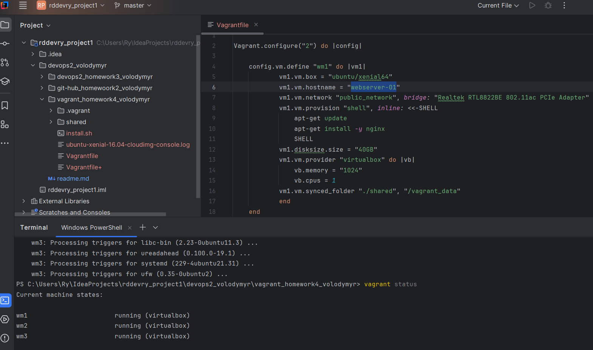

#### 2. VM2 (Приватний сервер)

- **Операційна система:** `xenial-server-cloudimg-amd64-vagrant.box`
- **Мережеве під'єднання:** Статичний IP через приватну мережу

  ```ruby
  vm2.vm.network "private_network", ip: "192.168.200.107"
  ```
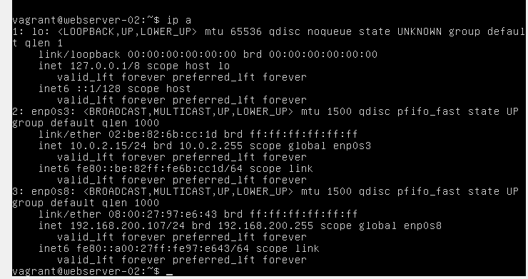
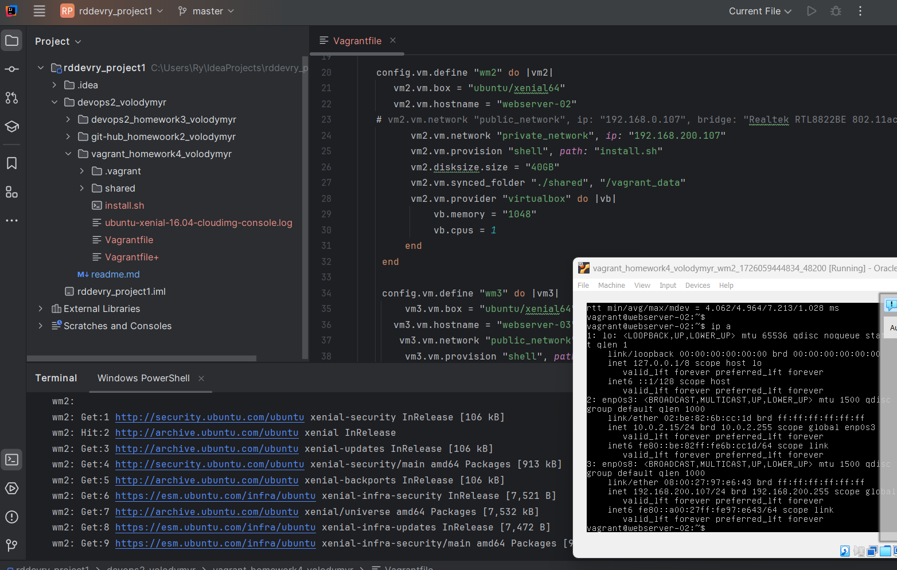


- **Спільна папка:** Між хостом і VM
- **Провізіонінг:** Використано зовнішній bash-скрипт `install.sh` для встановлення необхідних пакетів

  Склад файлу `install.sh`:

  ```bash
  #!/bin/bash
  sudo apt update
  sudo apt install -y nginx
  ```


### 3. VM3 (Загальнодоступний сервер зі статичним IP)

- **Операційна система:** `xenial-server-cloudimg-amd64-vagrant.box`
- **Мережеве під'єднання:** Статичний IP через загальнодоступну мережу
- **Конфігурація мережі:**

  ```ruby
  vm3.vm.network "public_network", ip: "192.168.43.221", bridge: "Realtek RTL8822BE 802.11ac PCIe Adapter"
  ```
[comment]: <> (
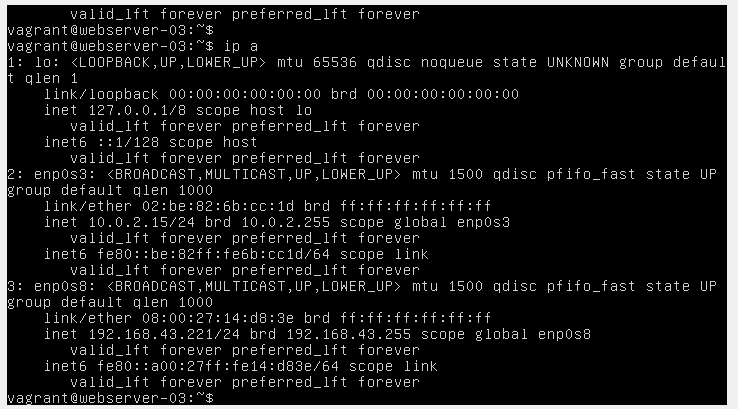


- **Окрема спільна папка:** Між хостом і VM

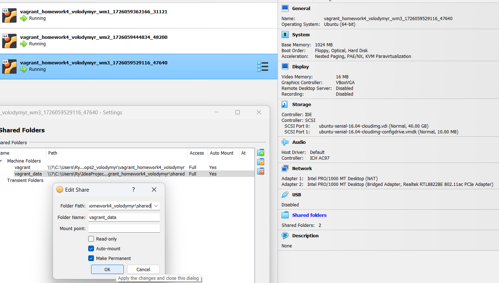

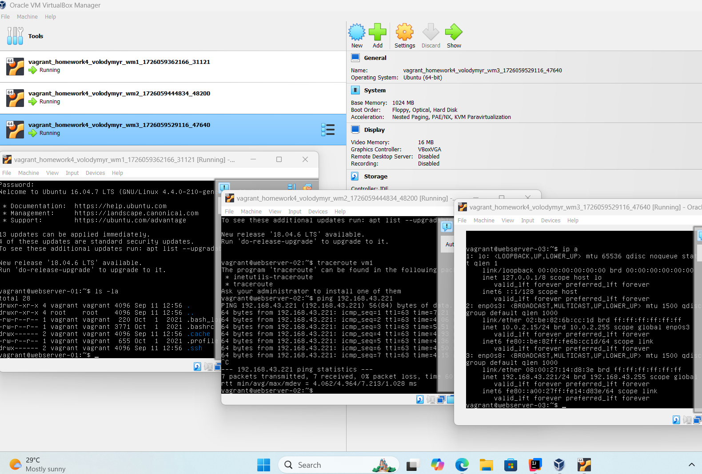


### Vagrantfile Конфігурація

```ruby
Vagrant.configure("2") do |config|

    config.vm.define "wm1" do |vm1|
            vm1.vm.box = "ubuntu/xenial64"
            vm1.vm.hostname = "webserver-01"
            vm1.vm.network "public_network", bridge: "Realtek RTL8822BE 802.11ac PCIe Adapter"
            vm1.vm.provision "shell", inline: <<-SHELL
                apt-get update
                apt-get install -y nginx
                SHELL
            vm1.disksize.size = "40GB"
            vm1.vm.provider "virtualbox" do |vb|
                vb.memory = "1024"
                vb.cpus = 1
            vm1.vm.synced_folder "./shared", "/vagrant_data"
            end
    end

   config.vm.define "wm2" do |vm2|
      vm2.vm.box = "ubuntu/xenial64"
      vm2.vm.hostname = "webserver-02"
   # vm2.vm.network "public_network", ip: "192.168.0.107", bridge: "Realtek RTL8822BE 802.11ac PCIe Adapter"
         vm2.vm.network "private_network", ip: "192.168.200.107"
         vm2.vm.provision "shell", path: "install.sh"
         vm2.disksize.size = "40GB"
         vm2.vm.synced_folder "./shared", "/vagrant_data"
         vm2.vm.provider "virtualbox" do |vb|
             vb.memory = "1048"
             vb.cpus = 1
        end
    end

    config.vm.define "wm3" do |vm3|
        vm3.vm.box = "ubuntu/xenial64"
        vm3.vm.hostname = "webserver-03"
        vm3.vm.network "public_network", ip: "192.168.43.221", bridge: "Realtek RTL8822BE 802.11ac PCIe Adapter"
        vm3.vm.provision "shell", path: "install.sh"
        vm3.disksize.size = "40GB"
        vm3.vm.provider "virtualbox" do |vb|
           vb.memory = "1024"
           vb.cpus = 1
        vm3.vm.synced_folder "./shared", "/vagrant_data"
        end
    end
end
```

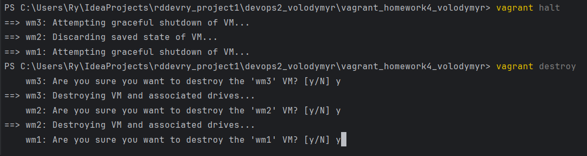

### Додаткове завдання

Створити три віртуальні машини з тією ж самою конфігурацією, що й VM2, без дублювання коду.

```ruby
# -*- mode: ruby -*-
# vi: set ft=ruby :
Vagrant.configure("2") do |config|
hosts = {
    "vm1" => "192.168.88.110",
    "vm2" => "192.168.88.111",
    "vm3" => "192.168.88.112"
}
    config.vm.box = "ubuntu/xenial64"
    hosts.each do |name, ip|
    config.vm.define name do |machine|
    machine.vm.network :private_network, ip: ip
    machine.vm.provider "virtualbox" do |v|
        v.name = name
        v.gui = false
        v.memory = "1024"
        v.cpus = 1
    end
end
    config.vm.provision "shell", path: "install.sh"
    #config.vm.network "forwarded_port", guest: 80, host: 8000
    end
end
```

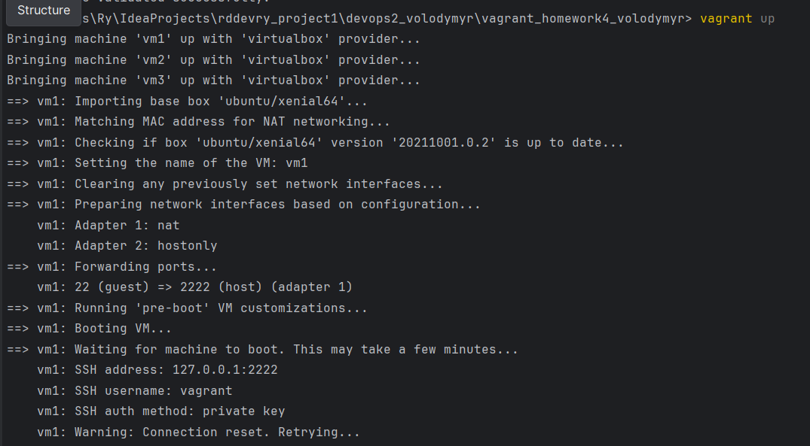

#### Конфігурація кожної VM

```ruby
machine.vm.provider "virtualbox" do |v|
  v.name = name
  v.gui = false
  v.memory = "1024"
  v.cpus = 1
```

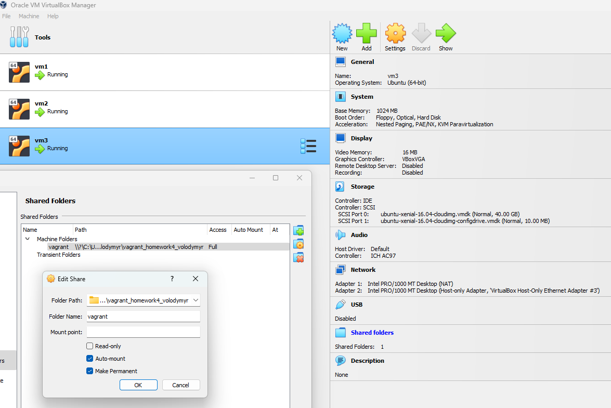


З хоста `"vm1" => "192.168.88.110"` є мережевий доступ до `"vm2" => "192.168.88.111"` та `"vm3" => "192.168.88.112"`.

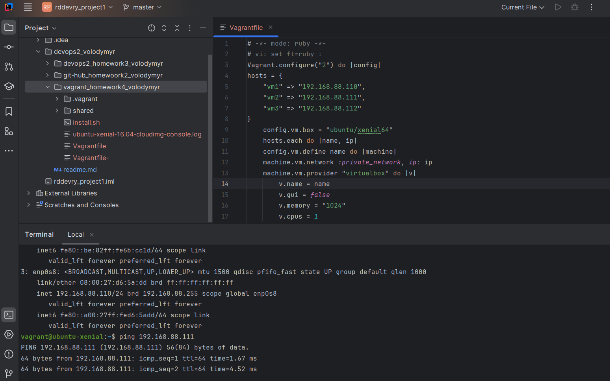


На кожній віртуальній машині VM1, VM2, VM3
За допомогою
config.vm.provision "shell", path: "install.sh"

Склад файлу  "install.sh"
```ruby
#!/bin/bash
sudo apt update
sudo apt install -y nginx
```

Інстальовано 3 сервери  NGINX

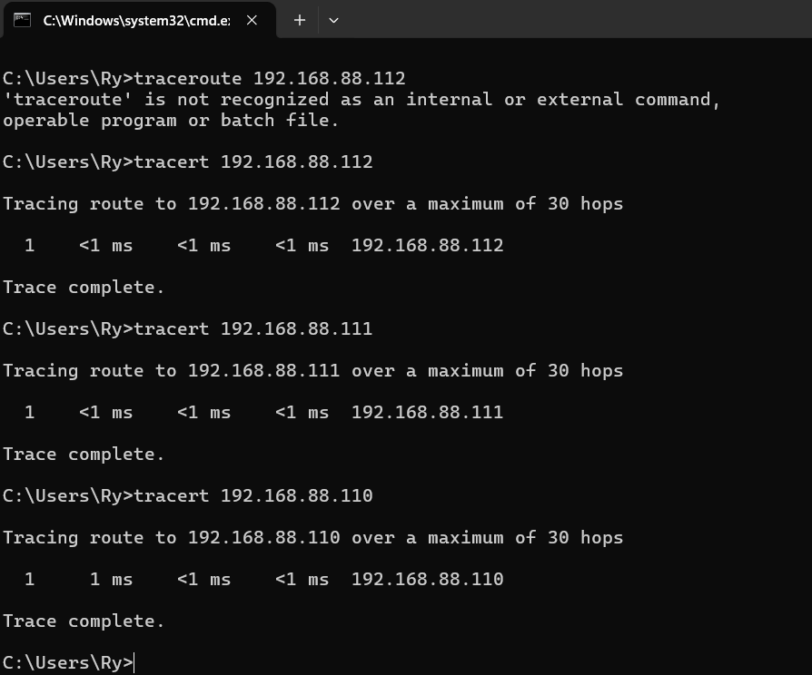
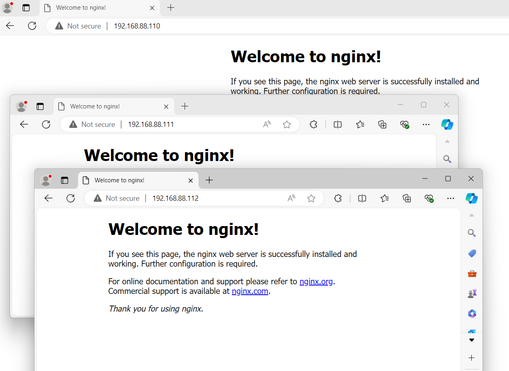
```

